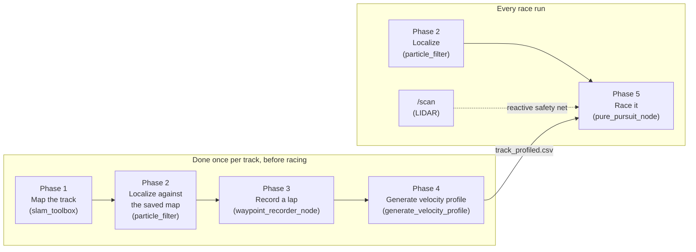

# Racing autonomy: SLAM, localization, and a pure-pursuit race controller

This is the algorithm reference for the `pure_pursuit` package: a map-based
race stack built on top of this car's existing SLAM (`slam_toolbox`) and
localization (`particle_filter`) packages. Read
[architecture.md](architecture.md) first if you haven't — this doc assumes
you already know the node graph and the safety model (joystick always wins
arbitration unless you deliberately stop it — see
[architecture.md](architecture.md#the-safety-model-read-this-before-writing-autonomy-code)).

For exact commands, see [operations.md](operations.md#racing-with-the-pure-pursuit-stack).
This doc is about *why* it's built this way and *how the algorithm works*,
line of reasoning by line of reasoning — the code itself
(`src/pure_pursuit/pure_pursuit/racing_math.py` above all) is written to be
read alongside this. For a more code-adjacent, file-by-file reference with
every formula and parameter in one place, see
[src/pure_pursuit/README.md](../src/pure_pursuit/README.md).

## Quick intuition (read this first if any of the below looks intimidating)

Skip the equations for a second — here's the whole system in plain
language, the way you'd explain it to someone who's never touched ROS:

- **Mapping:** drive the track once — by hand, or let the car do it
  *itself*, reactively, with nobody touching the steering (see Phase 1)
  — so the car ends up with a picture of where the walls are.
- **Localization:** the car constantly compares what its LIDAR sees right
  now against that picture to work out "where am I, exactly." Like
  finding your spot on a paper map by matching the shape of the room
  around you to the shape drawn on the page.
- **Recording a line, then pacing it:** drive one good lap, then a small
  program looks at how sharply the track turns everywhere and works out
  a sensible speed for every point on it — slow for tight corners, fast
  on straights, with braking that starts *before* the corner instead of
  right at it.
- **Driving it (Pure Pursuit):** imagine always picking a spot a little
  way ahead on the track and steering toward it, over and over, faster
  or slower depending on how fast you're supposed to be going right
  there. That's the entire control algorithm — see "Pure Pursuit, in
  plain terms" below.
- **Handling other cars:** notice something car-shaped in the way, work
  out whether you're catching up to it, and if so, aim slightly toward
  whichever side has more room until you're past it — then go straight
  back to the normal line.
- **Safety, always on top:** no matter what any of the above wants to do,
  if something gets too close for comfort, the car stops or steers
  around it first and asks questions later.

Everything past this point explains *why* each piece works the way it
does, with the actual math — useful once you want to tune it, extend it,
or just understand it properly, but not required to get the gist.

## Why this exists alongside `gap_follow`

`gap_follow` is *reactive*: it looks at the current LIDAR scan and steers at
the biggest gap, every cycle, with no memory of the track and no map. That
makes it robust and simple, but it is fundamentally short-sighted — it
cannot see around a corner, cannot plan a smooth line through an S-curve,
and has no notion of "this is a known 90° hairpin, start braking now." On a
track you get to drive/map in advance (i.e. almost every real race), that
short-sightedness costs real lap time.

`pure_pursuit` is *map-based*: it knows the whole track in advance as a
racing line with a precomputed speed at every point, and it knows exactly
where the car is on that line via localization. That lets it brake early,
carry more speed through corners it knows are coming, and drive the same
optimized line lap after lap. The trade-off is that it depends on a good
map and working localization — which is exactly why the LIDAR-based
reactive safety net (borrowed from the same idea as `gap_follow`) is still
layered underneath it, for anything the map doesn't know about (an
opponent's car, a spun-out car, debris).

## The five-phase pipeline



Phases 1–4 happen once, before you race, whenever the track is new or has
changed. Phase 5 is what actually drives the car; it's the only one running
during the race itself, and it depends on the outputs of all four phases
before it (a saved map, a working localization launch, and a profiled
`.csv`).

---

## Phase 1: Map the track (SLAM)

**In plain terms:** the car needs a picture of the track before it can
race on it, the same way you'd want to walk a new track once before
driving it flat-out. This phase is entirely about building that picture
— nothing here decides how fast or how well the car eventually races.

Two ways to actually do this lap, either one produces the same kind of
map:

- **By hand** — see [operations.md](operations.md#building-a-map). You
  drive the car around the track once by hand while `slam_toolbox`
  builds an occupancy grid map from `/scan` and `/odom`, then save it
  with `map_saver_cli`.
- **Autonomously, with nobody steering** — see
  [operations.md](operations.md#building-a-map-autonomously-no-steering-required).
  `gap_follow` already drives the car with no map at all, reactively
  steering into open space; running it *at the same time* as
  `slam_toolbox` means the car maps the track by driving itself around
  it, with `slam_toolbox` recording the map exactly as it would if a
  human were driving. **A human still has to hold LB the entire time** —
  see the note below — but nobody touches the steering stick. This needs
  zero new code: it's the same two existing pieces, just run together.

Either way, `pure_pursuit` doesn't touch this step at all; it consumes
the same saved map that `particle_filter` already uses.

**"I'm not driving it" still means someone is supervising it.** This
workspace's [mandatory LB-deadman
policy](architecture.md#workspace-policy-the-lb-deadman-button-is-mandatory-for-every-node-that-can-move-the-car)
applies to `gap_follow` here exactly as it does everywhere else: the car
will not move an inch unless a human is actively holding LB on the
physical controller, autonomous driving or not. "Not driving" means not
touching the steering/throttle sticks — it does not mean nobody needs to
be there. Think of it as a safety supervisor role, not a driving one.

**Why SLAM at all, if the racing line is what we actually drive?** Because
the racing line alone has no way to know *where the car currently is*. The
map is what makes localization (Phase 2) possible, and localization is what
lets Phase 5 know "the car is here on the racing line" every control tick.
Without a map, there is nothing to localize against, and the racing line is
just a shape with no connection to reality.

## Phase 2: Localize against the map (Monte Carlo Localization)

Also unchanged — this is `particle_filter`, already in this workspace,
using `range_libc` for fast GPU-accelerated ray casting. See
[operations.md](operations.md#localizing-against-a-saved-map) for the exact
launch procedure (including seeding it with RViz's "2D Pose Estimate" —
**pure_pursuit will not drive correctly, and may drive confidently in the
wrong direction, without this seed step**).

Quick conceptual summary, since Phase 5 depends entirely on trusting this
output: Monte Carlo Localization tracks a cloud of thousands of weighted
"particles" (candidate poses), each nudged forward by the motion model
(`/odom`) every timestep and re-weighted by how well a simulated LIDAR scan
from that particle's pose matches the *actual* `/scan` against the known
map. Particles that don't match reality die off; particles near the true
pose multiply. The weighted average of the surviving cloud is published as
`/pf/viz/inferred_pose` — the single best-guess pose `pure_pursuit_node`
subscribes to.

## Phase 3: Record a racing line

New: `waypoint_recorder_node`. With localization already running (Phase 2)
and the car under manual teleop control, this node subscribes to
`/pf/viz/inferred_pose` and appends the car's `(x, y)` position to a `.csv`
file every time the car has moved at least `min_spacing_m` (default
`0.15m`) since the last recorded point — filtering out the dense cluster of
near-duplicate points you'd otherwise get while stopped or moving slowly.

The file is opened once and **flushed to disk after every single point**,
not just on shutdown — if the Jetson crashes mid-lap, you keep everything
recorded up to that point instead of losing the whole lap. Stop recording
(`Ctrl+C`) once you're back near your start point; a "closed loop" racing
line doesn't need to close *exactly*, since Phase 4's smoothing already
treats the path as wrapping around.

Where you drive matters: this recorded line is *the* racing line — Phase 4
only paces it, it never reshapes it. Driving close to the actual racing
line you want (hugging the inside of corners where appropriate, wide
smooth arcs rather than jerky manual corrections) directly becomes what
the car repeats, lap after lap.

## Phase 4: Generate the velocity profile

New: the `generate_velocity_profile` command-line tool (not a ROS node —
it's an offline file-processing step, run once per recorded lap, not while
the car is moving). This is the first "very good algorithm" half of this
stack: turning a bare `(x, y)` path into a `(x, y, speed)` racing line by
figuring out how fast the car can safely go at every single point.

### Step 1 — curvature from three points

For every waypoint, look at it and its immediate neighbors (call them
$A$, $B$, $C$). There is exactly one circle passing through all three; a
tight corner produces a small circle (small radius, high curvature), a
gentle bend produces a large circle, and a straight line produces an
(effectively) infinite circle (zero curvature). Using the identity that a
triangle's area relates to its circumradius $R$ by $\text{area} = \frac{abc}{4R}$
(where $a,b,c$ are its side lengths):

$$R = \frac{|AB| \cdot |BC| \cdot |CA|}{4 \cdot \text{area}(A,B,C)} \qquad \kappa = \frac{1}{R} = \frac{4 \cdot \text{area}(A,B,C)}{|AB| \cdot |BC| \cdot |CA|}$$

This needs no calculus and no curve-fitting — just three neighboring
recorded points — which is exactly why it works directly on a raw,
slightly-noisy hand-driven recording. See
`racing_math.estimate_path_curvature()`.

### Step 2 — cornering speed from a simplified friction circle

A car driving a circular arc of curvature $\kappa$ at speed $v$ experiences
lateral acceleration $a_{lat} = v^2 \kappa$ (plain uniform circular motion).
Capping that at the car's actual grip limit $a_{lat,max}$ and solving for
$v$:

$$v_{corner} = \min\left(v_{max}, \sqrt{\dfrac{a_{lat,max}}{\kappa}}\right)$$

Tighter corners (`bigger kappa`) get a lower speed limit automatically.
This is a *simplified* friction circle — real tires trade off lateral vs.
longitudinal grip on a combined ellipse, and real chassis have weight
transfer, suspension behavior, etc. This model ignores all of that and
just uses one number, `a_lat_max`, as a conservative stand-in for "how hard
can this car actually corner." Tune it empirically (below).

### Step 3 — forward/backward smoothing (this is what creates real braking zones)

A raw per-point cornering-speed limit alone would ask the car to
*teleport* from race speed on a straight to walking pace at a corner's
apex, one waypoint before it — physically impossible. Two more passes fix
this, each capping how much the speed is allowed to change between
adjacent waypoints a distance $ds$ apart:

- **Forward (acceleration) pass**, left to right: $v_i \leftarrow \min\left(v_i,\ \sqrt{v_{i-1}^2 + 2\, a_{accel,max}\, ds}\right)$
- **Backward (braking) pass**, right to left: $v_i \leftarrow \min\left(v_i,\ \sqrt{v_{i+1}^2 + 2\, a_{brake,max}\, ds}\right)$

The backward pass is the important one for lap time: it's what propagates
a corner's low speed limit *backward* along the straight leading into it,
so the profile tells the car to start braking early enough to actually
make the corner, instead of "discovering" the corner's speed limit only
once it's already there. A closed-loop track has no single starting point
to seed these sweeps from cleanly (index 0's "previous" waypoint is the
*last* waypoint, whose value isn't finalized on the first sweep) — so both
passes are repeated `smoothing_passes` times (default 3) to let that
start/finish seam converge. Both passes only ever *lower* a speed, never
raise one, so extra passes past convergence are harmless no-ops — this is
why the same code path is used for open paths too, without a special case.

**This is not a time-optimal racing line.** A truly time-optimal line
solves for the path geometry *and* the speed profile together — usually
with a nonlinear/QP optimizer over the minimum-curvature path within track
bounds (e.g. TU Munich's open-source
[global_racetrajectory_optimization](https://github.com/TUMFTM/global_racetrajectory_optimization)).
This tool doesn't reshape the path at all — it only paces whatever line you
drove in Phase 3. That's a deliberate trade-off: no extra heavy
dependencies (no QP solver), a result you can sanity-check by eye, and a
lap time that's still very competitive if you record a good line by hand.
See [Limitations and how to go further](#limitations-and-how-to-go-further).

### Choosing `a_lat_max` / `a_accel_max` / `a_brake_max` / `v_max`

Exactly like every other speed parameter on this car: **start
conservative, raise gradually, re-test wheels-off-ground after every
change.**

1. Start with the tool's defaults (`a_lat_max=8.0`, `a_accel_max=3.0`,
   `a_brake_max=8.0`, `v_max=6.0` — all in SI units, m/s and m/s²).
2. Race a lap. If the car slides/understeers off the racing line in a
   corner, `a_lat_max` is set higher than the car's actual grip — lower it
   and regenerate the profile.
3. If the car brakes too late and runs wide exiting into a corner,
   `a_brake_max` is set higher than the car can actually achieve — lower
   it and regenerate.
4. Only once cornering is solid, raise `v_max` to actually use more of the
   straights.

## Phase 5: Race it — the Pure Pursuit controller

`pure_pursuit_node` is the only node that runs *during* the race. Every
control tick (default 40Hz, matching the LIDAR's scan rate), it does
exactly two jobs — steer, and set speed — followed by a set of
independent safety checks that can override either one.

### Why a fixed-rate timer, not the pose callback directly

The subscription callbacks (`pose_callback`, `scan_callback`) only ever
*cache* the latest message and its arrival time; the actual driving logic
in `control_loop()` runs on a `create_timer()` at a fixed rate instead.
If localization died outright and the control loop were driven directly by
`pose_callback`, the loop would simply stop being invoked — and the last
command published would stay "live" on `/drive` forever, with nothing left
to notice and stop it. A timer-driven loop keeps checking "is my data
still fresh?" on its own schedule regardless of whether new sensor data is
still arriving, so a dead sensor feed is something the watchdogs below can
actually catch.

### Steering: adaptive lookahead + Pure Pursuit geometry

1. **Find the nearest waypoint.** Compute the distance from the car's
   current `(x, y)` to every waypoint (or, once running, only to a small
   window of waypoints near last tick's answer — see
   *"Why a windowed nearest-point search"* below) and take the minimum.
   This also doubles as the **cross-track error** — how far the car
   currently is from the racing line.

2. **Pick a lookahead distance that scales with speed:**

   $$L_d = \text{clip}(k \cdot v + L_{min},\ L_{min},\ L_{max})$$

   A *fixed* lookahead is a bad compromise — short enough to corner
   tightly at parking-lot speed and the car oscillates/overshoots at race
   speed; long enough to be smooth at race speed and it cuts corners at
   low speed. Scaling lookahead with the current speed (`speed_here`, read
   from the racing line's own profile at the nearest waypoint) fixes both
   at once. Defaults: $L_{min}=0.6m$, $L_{max}=2.5m$, $k=0.35$ — at
   `max_speed`'s default of 4.0 m/s that's $0.35 \times 4 + 0.6 = 2.0m$,
   leaving a little headroom under the 2.5m cap for when you raise
   `max_speed` later (raise `max_lookahead` too if you push speed much
   higher).

3. **Walk forward from the nearest waypoint** along the recorded path,
   accumulating segment distances, until $L_d$ has been covered — that
   waypoint is the steering target. (Textbook Pure Pursuit intersects the
   path with a circle of radius $L_d$ centered on the car; walking the
   polyline and snapping to the next recorded point is a simpler
   approximation, accurate up to the spacing between recorded waypoints —
   keep that spacing small, per Phase 3's default of 0.15m, and the
   difference is negligible.)

4. **Transform the target into the car's body frame.** The map/world frame
   and the car's body frame (x forward, y left — REP-103) differ by the
   car's current heading $\psi$ (yaw, extracted from the pose's
   quaternion). Rotating a world-frame offset $(dx, dy)$ into body-frame
   coordinates:

   $$x_{body} = \cos\psi \cdot dx + \sin\psi \cdot dy \qquad y_{body} = -\sin\psi \cdot dx + \cos\psi \cdot dy$$

5. **Pure Pursuit's curvature formula.** Picture the one circle that
   passes through the origin (the car's rear axle) *and* through
   $(x_{body}, y_{body})$ (the target), tangent to the car's current
   heading (the body-frame x-axis) — i.e. centered somewhere on the
   body-frame y-axis at $(0, R)$. Solving for where that circle also
   passes through the target point gives:

   $$\kappa = \frac{2\, y_{body}}{x_{body}^2 + y_{body}^2}$$

   Target to the left ($y_{body}>0$) gives positive curvature; target to
   the right gives negative curvature — matching
   `AckermannDriveStamped`'s "positive `steering_angle` = left" convention
   directly, with no sign-flipping needed anywhere.

6. **Bicycle-model steering angle.** Collapsing the car's front/rear wheel
   pairs to a single front and single rear wheel (the standard car-like
   robot approximation), a vehicle with wheelbase $L$ needs a front steer
   angle:

   $$\delta = \arctan(L \cdot \kappa)$$

   Finally clipped to `max_steering_angle` (default `0.26 rad`, ≈15°) —
   see *"Where 0.26 rad comes from"* below.

### Speed: read straight from the profile

No separate control law here — the commanded speed is simply the
profiled speed at the car's *current* nearest waypoint (not the steering
target's), clipped to `[min_speed, max_speed]` as a hard safety ceiling
independent of whatever the `.csv` says. Using the car's current position
(rather than the lookahead target) means the speed command reflects "how
fast should I be going *right here, right now*" — the braking zones baked
into the profile by Phase 4 already account for what's coming up.

### Why a windowed nearest-point search

On a track that comes close to itself — a hairpin, a figure-eight, a pit
lane splitting off the main straight — the *globally* nearest waypoint by
raw distance is sometimes on a completely different part of the track than
the one the car is actually on. Restricting the nearest-point search to a
small window of waypoints (`nearest_search_window`, default 40) around
*last tick's* answer keeps the tracker locked onto the correct branch
instead of "teleporting" its target across the track. It's also simply
faster — O(window) instead of O(N) every tick — though at typical racing
line sizes (a few hundred to a couple thousand points) that speed
difference doesn't actually matter on the Jetson; correctness at
self-intersections is the real reason this exists.

### The safety layers

Six independent checks, each capable of unilaterally forcing a stop (or a
steering override), regardless of what the steering/speed logic above
computed. Ordered from "must never be violated" down to "nice to have":

| Check | Triggers when | Why |
|---|---|---|
| **LB deadman button** (checked first, ahead of everything else) | LB not held on a live `/joy` stream within `joy_timeout_sec` (default 0.5s) | **Mandatory workspace policy** — see [architecture.md](architecture.md#workspace-policy-the-lb-deadman-button-is-mandatory-for-every-node-that-can-move-the-car). Stays on (`enable_deadman: true`) until the team explicitly decides the car's behavior is trustworthy enough to relax it — don't set it `false` otherwise |
| Localization watchdog | No pose received yet, or `pose_topic` has gone quiet for more than `pose_timeout_sec` (default 0.5s) | Never drive on a stale or absent position estimate |
| Cross-track error | Nearest waypoint is farther than `max_cross_track_error` (default 1.0m) | Car is lost, kidnapped, or localization has diverged — the steering geometry would be aiming at a point unrelated to reality |
| Opponent detection + overtake steering | Another car detected and being closed on within `overtake_trigger_gap` (default 3.0m of *track* distance) | Not a safety check at all — a racing one. See [Racing against opponents](#racing-against-opponents-detection-tracking-and-overtaking) below. Always subordinate to the two checks after it |
| Reactive avoidance (steer around) | Minimum range in a wider `avoidance_fov_deg` cone (default 100°) is under `avoidance_trigger_distance` (default 1.5m) but a gap still exists | Catches anything *not* in the map that there's still room to get around — an opponent's car, a spun-out car, debris |
| Emergency hard stop (always wins) | Minimum range in a narrower `safety_fov_deg` cone (default 60°) is under `emergency_stop_distance` (default 0.4m), or `/scan` itself is stale/missing | Last resort, unconditional — a safety net that's gone blind is treated identically to "obstacle detected" |
| Unhandled exception | Anything in the control step raises | `control_loop()` wraps the whole step in try/except; on *any* exception it publishes a stop command *before* re-raising, so an unexpected bug can't leave the last (possibly full-speed) command sitting on `/drive` forever |

Because the deadman check runs first, holding LB is a precondition for the
car moving at all — releasing it stops the car immediately regardless of
what every other watchdog says. Concretely, this means **`joy_node` must be
up** while racing — it lives in `bringup_launch.py` (the shared foundation
every control layer needs), not `teleop_launch.py` (the manual-driving
control layer, which you simply don't launch during a race) — see
[operations.md](operations.md#racing-with-the-pure-pursuit-stack).

All of this sits *underneath* the same arbitration the rest of this repo
uses — `pure_pursuit_node` publishes to `/drive` exactly like `gap_follow`
does, and `ackermann_mux` + the joystick still have final say (see
[architecture.md](architecture.md#the-safety-model-read-this-before-writing-autonomy-code)).
None of the above replaces wheels-off-ground testing or a human ready to
cut power — see [operations.md](operations.md#racing-with-the-pure-pursuit-stack).

### Where `0.26 rad` comes from

This car's actual servo calibration
(`src/f1tenth_system/f1tenth_stack/config/vesc.yaml`):

```
servo_position = -1.2135 * steering_angle + 0.5304,   servo clamped to [0.15, 0.85]
```

Solving both ends for `steering_angle`: `servo=0.15` → `+0.313 rad`
(≈18°); `servo=0.85` → `-0.263 rad` (≈-15°). The rack is *asymmetric* —
it can turn further left than right. `max_steering_angle` uses the
smaller magnitude (`0.26`) so that a command in *either* direction is one
the servo can physically achieve, with a small margin. If this car's
`vesc.yaml` gain/offset/servo limits ever change (a different servo,
re-calibration), re-derive this number rather than leaving it stale.

---

## Racing against opponents: detection, tracking, and overtaking

**In plain terms:** a real racer doesn't just drive their own line and
hope -- they notice the car ahead, work out whether they're closing the
gap or falling behind, and if they're closing it, they look for room to
get past instead of following forever. This section is that same
thinking, done with LIDAR and arithmetic instead of eyes and instinct.
Three questions, asked every control tick:

1. **"Is that actually a car?"** -- look at the live scan for something
   shaped and sized like an opponent, sitting out in the open track (not
   a wall).
2. **"Am I catching them?"** -- track how far along the track they are,
   the same way the ego car's own progress is already tracked, and
   compare how fast each is gaining ground.
3. **"Where's the room?"** -- if catching them, find whichever side has
   more space and steer the racing-line target over there until safely
   past, then merge straight back onto the recorded line.

None of this needs a second sensor, a neural network, or any
communication with the other car -- it's built entirely from the same
`/scan` and racing line every other part of this stack already uses.

### 1. "Is that a car?" -- detecting an opponent from raw LIDAR points

Real object detection (telling a car apart from a trash can, a cone, a
wall) usually means a camera and a trained model. Neither is running in
this stack, so opponent detection here is a *geometric* heuristic
instead -- genuinely more limited than that, but cheap, fast,
dependency-free, and good enough to race against another F1TENTH car
specifically, which is the one thing it actually needs to do.

**Step 1 -- group the scan into objects.** Walk the scan and split it into
clusters: runs of consecutive readings that are all "something's there"
(clearly less than the sensor's max range) and don't jump by more than a
small threshold from one beam to the next. A big jump between neighbors
means a *different* object, even if both readings are close -- e.g. a car
sitting in front of a wall shows up as one cluster for the car, a jump,
then a separate cluster for the wall behind it (`cluster_scan_ranges`).

**Step 2 -- measure each cluster.** For a cluster spanning `start_idx` to
`end_idx`, convert its first and last point to Cartesian coordinates and
take the straight-line distance between them -- its **chord width**. This
is a far better size estimate than angular width alone, which
exaggerates anything close and shrinks anything far away
(`cluster_geometry`):

$$\text{width} = \sqrt{(x_{end}-x_{start})^2 + (y_{end}-y_{start})^2}$$

**Step 3 -- keep only the ones shaped like a car.** A real opponent, seen
from the side or the back, is roughly car-width: reject anything
narrower (`opponent_min_width`, default 0.15m -- noise, a thin post) or
wider (`opponent_max_width`, default 0.7m -- almost certainly a wall
segment, which produces much longer or far more irregular runs). Also
confirm there's clearly *more open space* immediately on both sides of
the cluster than the cluster's own distance (`opponent_open_side_margin`)
-- a car sitting in the middle of the track has open track on both sides
of it; a bump in a curving wall usually doesn't
(`detect_opponent_cluster`). Among everything that passes every check,
the *closest* one wins -- the one most immediately relevant to a decision
right now.

This is a heuristic, not certainty -- see
[Limitations](#limitations-and-how-to-go-further) for exactly what that
means in practice.

### 2. "Am I catching them?" -- tracking progress along the track, not raw position

**In plain terms:** instead of asking "where is the other car in x/y
space" (and then having to guess where the track goes from there to
predict anything), this asks "how far around the *track* are they" -- the
exact same question already asked about the ego car every tick.
Comparing two of those numbers directly answers "am I ahead or behind,
and by how much track distance."

Every waypoint on the racing line already has a **cumulative arc
length** -- the track distance from the start to that point
(`compute_cumulative_arc_length`, computed once at startup, a running
total of `seg_len`). Finding the opponent's *own* nearest waypoint (the
exact same `find_nearest_index` the ego car uses on itself) and reading
its arc length gives "how far around the track the opponent currently
is" -- directly comparable to the ego car's own position, on the same
scale.

**Predicting where they'll be** is then just tracking how that number
changes over time. `OpponentTracker` keeps an exponentially-smoothed
estimate of the opponent's **progress rate** (their speed *along the
track*, in m/s) from tick to tick:

$$\text{rate} \leftarrow \alpha \cdot \frac{\Delta(\text{arc length})}{\Delta t} + (1-\alpha)\cdot\text{rate}$$

This is a deliberately simple stand-in for what's sometimes called a
*Frenet-frame* prediction in more formal autonomous-driving research:
reasoning about another vehicle's position and speed **relative to a
reference path**, rather than in raw x/y. Predicting "opponent's arc
length one second from now" is then just `arc_length + rate * 1.0` -- a
prediction that automatically follows the track's own curvature, because
it's expressed in track distance rather than a straight line the
opponent would otherwise have to be assumed to be driving off of.

**"Ahead" wraps around the finish line.** On a closed loop, the opponent
being "0.3 laps ahead" and "0.7 laps behind" describe the same physical
gap looked at from two directions; `track_progress_gap` always reports
the *ahead* distance, wrapping past the start/finish line where needed,
so "how close am I to catching them" is always one consistent, positive
number.

### 3. Deciding, and executing, an overtake

An overtake starts when **both** are true:
- the opponent is within `overtake_trigger_gap` meters of *track
  distance* ahead (not straight-line distance -- a hairpin apex might be
  1m away in a straight line but 8m away along the actual track), and
- the ego car's current profiled speed exceeds the opponent's tracked
  progress rate by at least `overtake_closing_margin` -- i.e. actually
  gaining ground, not just nearby.

Once triggered, **which side to pass on** is decided once, from the same
scan that found the opponent in the first place: average the range
readings in a small window just past each end of the opponent's cluster,
and pick whichever side is more open (`pick_pass_side`). This reuses
exactly the reasoning `gap_follow`'s own avoidance logic already uses --
finding open space in a scan -- just applied to "which side of this one
object" instead of "which gap in this whole scene."

**Executing the pass** doesn't touch the recorded racing line at all -- it
nudges the *steering target* sideways instead. `lateral_offset_point`
takes the current Pure Pursuit target waypoint, estimates the track's
local direction of travel from it to the next waypoint, and offsets the
target perpendicular to that direction by `overtake_lateral_offset`
meters, toward the chosen side. Steering is then computed from *that*
shifted point using the exact same Pure Pursuit geometry as always -- the
overtake is really just "aim slightly to one side for a while," not a
separate control system.

**Ending the overtake** happens once the ego car's own arc length is
`overtake_clear_margin` meters past the opponent's *last known* position
-- deliberately not re-checked against a fresh detection every tick, since
alongside or just past an opponent it commonly falls completely out of
the forward LIDAR cone, and that must not look like "lost it, panic"
rather than "passed it, done." If the tracked opponent goes stale
(`opponent_lost_timeout_sec`, default 1s, with no update at all) with no
overtake in progress, tracking is simply cleared -- nothing to react to.

**This always sits underneath the existing reactive safety net, never
instead of it.** If an overtake maneuver (or anything else) brings the
car within `emergency_stop_distance` of *anything*, the hard-stop tier
described above still wins, unconditionally, regardless of what the
overtake logic wanted to do. Racing strategy never gets to override
safety -- see [The safety layers](#the-safety-layers) above.

### Why this design, and not something fancier

A full solution to "race well against an opponent" is a genuinely hard,
active research problem -- game-theoretic planning, learned opponent
models, joint trajectory optimization. None of that is what's built here,
deliberately:

- **No opponent communication or shared telemetry.** This works from
  `/scan` alone, the same sensor everything else in this stack already
  depends on -- no assumption the other car is friendly, instrumented, or
  running compatible software.
- **Single-opponent, not a field.** "The closest qualifying cluster wins"
  means this reasons about one opponent at a time. A real multi-car pack
  would need per-object identity tracking (recognizing cluster #3 this
  tick as the same car as cluster #3 last tick, even after a brief
  occlusion) -- a legitimate next step, not attempted here.
- **A geometric heuristic, not classification.** "Car-sized cluster,
  isolated, with open space around it" will occasionally misfire -- see
  [Limitations](#limitations-and-how-to-go-further).
- **No blocking/defensive maneuvers.** If an opponent is closing in from
  *behind*, this stack does nothing different -- it just keeps driving
  its own optimized line. That's a deliberate, safety-conscious choice:
  defensive blocking in real racing carries real contact risk, and
  "drive your own best line consistently" is itself a legitimate,
  effective strategy without needing to reason about another car's
  intentions at all.

---

## Why Pure Pursuit (and not gap_follow alone, and not full MPC)

Three broad options exist for the control layer once you have a racing
line: stay purely reactive (`gap_follow`'s approach, but that throws away
the racing line entirely), Pure Pursuit (what's implemented here), or a
full Model Predictive Controller that optimizes steering *and* speed
together over a rolling time horizon.

Pure Pursuit was chosen deliberately:

- **Robust and simple to reason about.** The entire control law is two
  closed-form formulas (curvature, then steering angle) — no solver, no
  iteration, no convergence to worry about, no risk of a control loop
  silently taking too long and missing a deadline on a resource-limited
  Jetson Orin Nano.
- **Provably bounded per-tick cost.** A nearest-point search plus a short
  forward walk plus two `atan`s — comfortably real-time at 40Hz.
- **Well-understood failure modes.** "Lookahead too short → oscillation,
  too long → corner-cutting" is a one-line tuning heuristic, not a cost
  function to re-derive.
- **A genuinely strong track record** — this is the same core algorithm
  used across a large fraction of real competitive F1TENTH/roboracer
  teams' race stacks, precisely because it's fast enough to actually trust
  under race-day time pressure.

A full MPC can, in principle, out-perform this by planning several moves
ahead and reasoning explicitly about the car's dynamic limits — but it
needs an accurate dynamics model, a QP/NLP solver running fast enough for
40Hz control on limited hardware, and a lot more that can silently go
wrong under time pressure. That's a legitimate next step (see below), not
a reason to ship something harder to trust for this iteration.

## Parameter reference

All of these live in `src/pure_pursuit/config/pure_pursuit.yaml` (see that
file for inline comments too):

| Parameter | Default | Meaning |
|---|---|---|
| `waypoints_file` | *(required)* | Profiled `(x,y,speed)` `.csv` from `generate_velocity_profile` |
| `closed_loop` | `true` | Whether the racing line wraps around (a normal lap track) |
| `pose_topic` | `/pf/viz/inferred_pose` | Localization input |
| `scan_topic` | `/scan` | LIDAR input for the reactive safety net |
| `drive_topic` | `/drive` | Output, arbitrated by `ackermann_mux` like every other autonomy node |
| `control_rate_hz` | `40.0` | Control loop frequency |
| `wheelbase` | `0.25` | Meters; must match `vesc.yaml` |
| `min_lookahead` / `max_lookahead` / `lookahead_speed_gain` | `0.6` / `2.5` / `0.35` | Adaptive lookahead formula, see above |
| `nearest_search_window` | `40` | +/- waypoints searched around last tick's nearest point (`0` = search all) |
| `max_speed` / `min_speed` | `4.0` / `0.5` | Hard safety ceiling/floor, independent of the `.csv` |
| `max_steering_angle` | `0.26` | rad; derived from this car's real servo limits, see above |
| `pose_timeout_sec` | `0.5` | Localization watchdog |
| `max_cross_track_error` | `1.0` | Lost/kidnapped watchdog, meters |
| `enable_lidar_safety` | `true` | Master switch for the entire reactive net below (avoidance + opponent overtaking both require this too) |
| `safety_fov_deg` | `60.0` | Width of the narrow forward cone checked for the hard emergency stop |
| `emergency_stop_distance` | `0.4` | Meters; hard stop, always wins |
| `scan_timeout_sec` | `0.5` | LIDAR staleness watchdog |
| `enable_obstacle_avoidance` | `true` | Steer around something close instead of just stopping, when there's room |
| `avoidance_fov_deg` | `100.0` | Wider cone used for avoidance steering (and opponent detection) |
| `avoidance_trigger_distance` | `1.5` | Meters; closer than this (but outside `emergency_stop_distance`) triggers avoidance steering |
| `avoidance_min_gap_distance` | `1.0` | Meters; minimum depth for a gap to be considered driveable during avoidance |
| `avoidance_speed` | `1.0` | m/s; capped speed while avoidance steering is active |
| `enable_opponent_overtake` | `true` | See [Racing against opponents](#racing-against-opponents-detection-tracking-and-overtaking). Requires `enable_lidar_safety` too |
| `opponent_min_width` / `opponent_max_width` | `0.15` / `0.7` | Meters; car-shaped cluster width bounds |
| `opponent_cluster_gap` | `0.3` | Meters; range jump that splits one cluster into two |
| `opponent_engagement_range` | `5.0` | Meters; ignore detections farther than this |
| `opponent_open_side_margin` | `0.5` | Meters; how much more open the surroundings must be to count as "isolated" |
| `opponent_velocity_smoothing` | `0.3` | 0-1; exponential smoothing on the tracked progress-rate estimate |
| `opponent_lost_timeout_sec` | `1.0` | Forget the tracked opponent if not re-detected within this long |
| `overtake_trigger_gap` | `3.0` | Meters of *track distance*; start considering a pass this close |
| `overtake_closing_margin` | `0.3` | m/s; must be closing at least this fast to attempt a pass |
| `overtake_clear_margin` | `1.0` | Meters of track distance past the opponent before resuming the racing line |
| `overtake_lateral_offset` | `0.5` | Meters; sideways nudge to the steering target while passing |
| `laser_offset_x` / `laser_offset_y` | `0.27` / `0.0` | LIDAR mounting offset from `base_link`, used to place detections in the map frame |
| `enable_deadman` | `true` | **Mandatory workspace policy** — LB deadman button, checked first. Leave `true`; see [architecture.md](architecture.md#workspace-policy-the-lb-deadman-button-is-mandatory-for-every-node-that-can-move-the-car) |
| `joy_topic` | `/joy` | Deadman button input |
| `deadman_button` | `4` | Button index (LB on the F710 in XInput mode) |
| `joy_timeout_sec` | `0.5` | Deadman button staleness watchdog |

`generate_velocity_profile`'s physical-limit flags (`--v-max`,
`--a-lat-max`, `--a-accel-max`, `--a-brake-max`, `--smoothing-passes`) are
documented via `--help` and in Phase 4 above.

## Tuning guide: symptom → likely cause → fix

| Symptom | Likely cause | Fix |
|---|---|---|
| Car oscillates side to side on straights | Lookahead too short | Raise `min_lookahead` and/or `lookahead_speed_gain` |
| Car cuts across the inside of corners | Lookahead too long | Lower `lookahead_speed_gain` and/or `max_lookahead` |
| Car slides/understeers off the line mid-corner | `a_lat_max` set higher than actual grip | Lower `--a-lat-max`, regenerate the profile |
| Car runs wide exiting into a corner (braked too late/too gently) | `a_brake_max` set higher than the car can achieve | Lower `--a-brake-max`, regenerate the profile |
| Car never reaches a satisfying top speed on straights | `v_max`/`max_speed` capped low, or straights too short to reach it (see the lookahead note above) | Raise gradually, re-test wheels-off-ground each time |
| Car stops unexpectedly mid-lap | Cross-track watchdog tripped — localization drifted, bad "2D Pose Estimate" seed, or genuinely off the recorded line | Check RViz's localized pose against reality; re-seed; only loosen `max_cross_track_error` once you've confirmed localization itself is healthy |
| Node refuses to launch | `waypoints_file` unset, missing, or still a raw (no `speed` column) recording | Point it at a *profiled* `.csv`; run `generate_velocity_profile` first |
| Car stops the instant it starts, even in open space | `enable_lidar_safety` is on but no `/scan` has arrived yet (fails safe on purpose) | Confirm `urg_node`/the LIDAR driver is actually running and publishing `/scan` |
| Car swerves at a wall/curve like it's an opponent | A curving wall segment briefly measured as car-width | Narrow `opponent_min_width`/`opponent_max_width`, or raise `opponent_open_side_margin` so only genuinely isolated objects qualify |
| Car never attempts to overtake a slower car ahead | Not closing fast enough, or opponent not detected at all | Check `ros2 topic echo /scan` for a plausible cluster; lower `overtake_closing_margin`; confirm the opponent isn't outside `opponent_engagement_range` |
| Car overtakes then swerves back too early/late | `overtake_clear_margin` mismatched to this car's actual length/handling | Raise it if the pass looks unfinished when it ends, lower it if the car lingers off-line too long after passing |

## How this wins races

On a track you get to map and drive in advance — true of nearly every
real race — the single biggest lap-time lever isn't reaction speed, it's
*carrying more speed through corners you already know are coming* and
*starting to brake at exactly the right moment, every single lap,
identically*. A purely reactive controller re-derives "what should I do
right now" from scratch every cycle with no memory of the track, which
means it can't plan a smooth line through a corner it can't yet see, and
it can't consistently reproduce a good line lap after lap. This stack's
whole design is aimed at removing that ceiling: know the track, know
exactly where you are on it, and drive the fastest line your tires can
actually hold — while keeping a reactive safety net running underneath
for the one thing a map genuinely can't know about: whatever wasn't there
when you built it.

## Limitations and how to go further

Being direct about what this *doesn't* do, as a map for where to take it
next:

- **The racing line is only as good as the lap you recorded.** Phase 4
  paces your line; it never reshapes it. A proper next step is a
  minimum-curvature path optimizer (e.g. the TUM tool linked above) that
  re-derives the geometrically fastest line within the track's actual
  width, not just your driven line.
- **The velocity profile is a simplified friction-circle model**, not a
  full vehicle dynamics simulation — no combined lateral/longitudinal tire
  ellipse, no weight transfer, no slip-angle model.
- **Pure Pursuit doesn't reason about the future beyond one lookahead
  point.** A full MPC could plan the next N steps jointly against an
  actual dynamics model — a legitimate, harder next project once this
  baseline is solid and trusted.
- **Localization is dead-reckoning-fused-with-LIDAR only** — no IMU/wheel
  encoder sensor fusion beyond what `particle_filter`/`vesc_to_odom`
  already do. Better odometry directly means a tighter, more trustworthy
  `max_cross_track_error`.
- **Opponent detection is a geometric heuristic, not real object
  recognition.** "Car-sized isolated cluster" has no notion of what a
  car actually looks like beyond that — a stray cone, a dropped water
  bottle, or a chunk cut out of a curving wall could occasionally satisfy
  the same geometry. It also only reasons about one opponent at a time
  (closest qualifying cluster wins) and does zero identity-tracking
  across brief occlusions — see ["Racing against
  opponents"](#racing-against-opponents-detection-tracking-and-overtaking)
  for the full reasoning and what a sturdier version would need (camera +
  learned detection, multi-object tracking, or both).
- **No defensive/blocking driving.** If an opponent is closing from
  behind, this stack doesn't react any differently — a deliberate,
  safety-conscious choice, not an oversight; see the same section above.

## File map

```
src/pure_pursuit/
├── pure_pursuit/
│   ├── racing_math.py              # all the math above, framework-agnostic, unit-tested
│   ├── pure_pursuit_node.py        # Phase 5 — the race controller
│   ├── waypoint_recorder_node.py   # Phase 3 — records a driven lap
│   └── generate_velocity_profile.py # Phase 4 — CLI tool, paces a recorded lap
├── config/
│   ├── pure_pursuit.yaml
│   └── waypoint_recorder.yaml
├── launch/
│   ├── pure_pursuit_launch.py
│   └── waypoint_recorder_launch.py
├── waypoints/
│   └── example_stadium_raw.csv     # synthetic example track — see docs/operations.md
└── test/
    └── test_racing_math.py         # run: python3 -m pytest src/pure_pursuit/test/ -v

src/racerbot_launch/launch/race_launch.py   # localization + pure_pursuit together, race day
```
