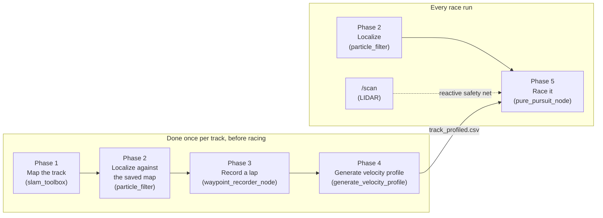

# Racing autonomy: SLAM, localization, and a pure-pursuit race controller

This is the algorithm reference for the `pure_pursuit` package: a map-based
race stack built on top of this car's existing SLAM (`slam_toolbox`) and
localization (`particle_filter`) packages. Read
[architecture.md](architecture.md) first if you haven't — this doc assumes
you already know the node graph and the safety model (joystick always wins
arbitration unless you deliberately stop it — see
[architecture.md](architecture.md#the-safety-model-read-this-before-writing-autonomy-code)).

For exact commands, see [operations.md](operations.md#racing-with-the-pure-pursuit-stack).
This doc is about *why* it's built this way and *how the algorithm works*,
line of reasoning by line of reasoning — the code itself
(`src/pure_pursuit/pure_pursuit/racing_math.py` above all) is written to be
read alongside this. For a more code-adjacent, file-by-file reference with
every formula and parameter in one place, see
[src/pure_pursuit/README.md](../src/pure_pursuit/README.md).

## Why this exists alongside `gap_follow`

`gap_follow` is *reactive*: it looks at the current LIDAR scan and steers at
the biggest gap, every cycle, with no memory of the track and no map. That
makes it robust and simple, but it is fundamentally short-sighted — it
cannot see around a corner, cannot plan a smooth line through an S-curve,
and has no notion of "this is a known 90° hairpin, start braking now." On a
track you get to drive/map in advance (i.e. almost every real race), that
short-sightedness costs real lap time.

`pure_pursuit` is *map-based*: it knows the whole track in advance as a
racing line with a precomputed speed at every point, and it knows exactly
where the car is on that line via localization. That lets it brake early,
carry more speed through corners it knows are coming, and drive the same
optimized line lap after lap. The trade-off is that it depends on a good
map and working localization — which is exactly why the LIDAR-based
reactive safety net (borrowed from the same idea as `gap_follow`) is still
layered underneath it, for anything the map doesn't know about (an
opponent's car, a spun-out car, debris).

## The five-phase pipeline



Phases 1–4 happen once, before you race, whenever the track is new or has
changed. Phase 5 is what actually drives the car; it's the only one running
during the race itself, and it depends on the outputs of all four phases
before it (a saved map, a working localization launch, and a profiled
`.csv`).

---

## Phase 1: Map the track (SLAM)

Unchanged from the existing stack — see
[operations.md](operations.md#building-a-map). You drive the car around the
track once by hand while `slam_toolbox` builds an occupancy grid map from
`/scan` and `/odom`, then save it with `map_saver_cli`. `pure_pursuit`
doesn't touch this step at all; it consumes the same saved map that
`particle_filter` already uses.

**Why SLAM at all, if the racing line is what we actually drive?** Because
the racing line alone has no way to know *where the car currently is*. The
map is what makes localization (Phase 2) possible, and localization is what
lets Phase 5 know "the car is here on the racing line" every control tick.
Without a map, there is nothing to localize against, and the racing line is
just a shape with no connection to reality.

## Phase 2: Localize against the map (Monte Carlo Localization)

Also unchanged — this is `particle_filter`, already in this workspace,
using `range_libc` for fast GPU-accelerated ray casting. See
[operations.md](operations.md#localizing-against-a-saved-map) for the exact
launch procedure (including seeding it with RViz's "2D Pose Estimate" —
**pure_pursuit will not drive correctly, and may drive confidently in the
wrong direction, without this seed step**).

Quick conceptual summary, since Phase 5 depends entirely on trusting this
output: Monte Carlo Localization tracks a cloud of thousands of weighted
"particles" (candidate poses), each nudged forward by the motion model
(`/odom`) every timestep and re-weighted by how well a simulated LIDAR scan
from that particle's pose matches the *actual* `/scan` against the known
map. Particles that don't match reality die off; particles near the true
pose multiply. The weighted average of the surviving cloud is published as
`/pf/viz/inferred_pose` — the single best-guess pose `pure_pursuit_node`
subscribes to.

## Phase 3: Record a racing line

New: `waypoint_recorder_node`. With localization already running (Phase 2)
and the car under manual teleop control, this node subscribes to
`/pf/viz/inferred_pose` and appends the car's `(x, y)` position to a `.csv`
file every time the car has moved at least `min_spacing_m` (default
`0.15m`) since the last recorded point — filtering out the dense cluster of
near-duplicate points you'd otherwise get while stopped or moving slowly.

The file is opened once and **flushed to disk after every single point**,
not just on shutdown — if the Jetson crashes mid-lap, you keep everything
recorded up to that point instead of losing the whole lap. Stop recording
(`Ctrl+C`) once you're back near your start point; a "closed loop" racing
line doesn't need to close *exactly*, since Phase 4's smoothing already
treats the path as wrapping around.

Where you drive matters: this recorded line is *the* racing line — Phase 4
only paces it, it never reshapes it. Driving close to the actual racing
line you want (hugging the inside of corners where appropriate, wide
smooth arcs rather than jerky manual corrections) directly becomes what
the car repeats, lap after lap.

## Phase 4: Generate the velocity profile

New: the `generate_velocity_profile` command-line tool (not a ROS node —
it's an offline file-processing step, run once per recorded lap, not while
the car is moving). This is the first "very good algorithm" half of this
stack: turning a bare `(x, y)` path into a `(x, y, speed)` racing line by
figuring out how fast the car can safely go at every single point.

### Step 1 — curvature from three points

For every waypoint, look at it and its immediate neighbors (call them
$A$, $B$, $C$). There is exactly one circle passing through all three; a
tight corner produces a small circle (small radius, high curvature), a
gentle bend produces a large circle, and a straight line produces an
(effectively) infinite circle (zero curvature). Using the identity that a
triangle's area relates to its circumradius $R$ by $\text{area} = \frac{abc}{4R}$
(where $a,b,c$ are its side lengths):

$$R = \frac{|AB| \cdot |BC| \cdot |CA|}{4 \cdot \text{area}(A,B,C)} \qquad \kappa = \frac{1}{R} = \frac{4 \cdot \text{area}(A,B,C)}{|AB| \cdot |BC| \cdot |CA|}$$

This needs no calculus and no curve-fitting — just three neighboring
recorded points — which is exactly why it works directly on a raw,
slightly-noisy hand-driven recording. See
`racing_math.estimate_path_curvature()`.

### Step 2 — cornering speed from a simplified friction circle

A car driving a circular arc of curvature $\kappa$ at speed $v$ experiences
lateral acceleration $a_{lat} = v^2 \kappa$ (plain uniform circular motion).
Capping that at the car's actual grip limit $a_{lat,max}$ and solving for
$v$:

$$v_{corner} = \min\left(v_{max}, \sqrt{\dfrac{a_{lat,max}}{\kappa}}\right)$$

Tighter corners (`bigger kappa`) get a lower speed limit automatically.
This is a *simplified* friction circle — real tires trade off lateral vs.
longitudinal grip on a combined ellipse, and real chassis have weight
transfer, suspension behavior, etc. This model ignores all of that and
just uses one number, `a_lat_max`, as a conservative stand-in for "how hard
can this car actually corner." Tune it empirically (below).

### Step 3 — forward/backward smoothing (this is what creates real braking zones)

A raw per-point cornering-speed limit alone would ask the car to
*teleport* from race speed on a straight to walking pace at a corner's
apex, one waypoint before it — physically impossible. Two more passes fix
this, each capping how much the speed is allowed to change between
adjacent waypoints a distance $ds$ apart:

- **Forward (acceleration) pass**, left to right: $v_i \leftarrow \min\left(v_i,\ \sqrt{v_{i-1}^2 + 2\, a_{accel,max}\, ds}\right)$
- **Backward (braking) pass**, right to left: $v_i \leftarrow \min\left(v_i,\ \sqrt{v_{i+1}^2 + 2\, a_{brake,max}\, ds}\right)$

The backward pass is the important one for lap time: it's what propagates
a corner's low speed limit *backward* along the straight leading into it,
so the profile tells the car to start braking early enough to actually
make the corner, instead of "discovering" the corner's speed limit only
once it's already there. A closed-loop track has no single starting point
to seed these sweeps from cleanly (index 0's "previous" waypoint is the
*last* waypoint, whose value isn't finalized on the first sweep) — so both
passes are repeated `smoothing_passes` times (default 3) to let that
start/finish seam converge. Both passes only ever *lower* a speed, never
raise one, so extra passes past convergence are harmless no-ops — this is
why the same code path is used for open paths too, without a special case.

**This is not a time-optimal racing line.** A truly time-optimal line
solves for the path geometry *and* the speed profile together — usually
with a nonlinear/QP optimizer over the minimum-curvature path within track
bounds (e.g. TU Munich's open-source
[global_racetrajectory_optimization](https://github.com/TUMFTM/global_racetrajectory_optimization)).
This tool doesn't reshape the path at all — it only paces whatever line you
drove in Phase 3. That's a deliberate trade-off: no extra heavy
dependencies (no QP solver), a result you can sanity-check by eye, and a
lap time that's still very competitive if you record a good line by hand.
See [Limitations and how to go further](#limitations-and-how-to-go-further).

### Choosing `a_lat_max` / `a_accel_max` / `a_brake_max` / `v_max`

Exactly like every other speed parameter on this car: **start
conservative, raise gradually, re-test wheels-off-ground after every
change.**

1. Start with the tool's defaults (`a_lat_max=8.0`, `a_accel_max=3.0`,
   `a_brake_max=8.0`, `v_max=6.0` — all in SI units, m/s and m/s²).
2. Race a lap. If the car slides/understeers off the racing line in a
   corner, `a_lat_max` is set higher than the car's actual grip — lower it
   and regenerate the profile.
3. If the car brakes too late and runs wide exiting into a corner,
   `a_brake_max` is set higher than the car can actually achieve — lower
   it and regenerate.
4. Only once cornering is solid, raise `v_max` to actually use more of the
   straights.

## Phase 5: Race it — the Pure Pursuit controller

`pure_pursuit_node` is the only node that runs *during* the race. Every
control tick (default 40Hz, matching the LIDAR's scan rate), it does
exactly two jobs — steer, and set speed — followed by a set of
independent safety checks that can override either one.

### Why a fixed-rate timer, not the pose callback directly

The subscription callbacks (`pose_callback`, `scan_callback`) only ever
*cache* the latest message and its arrival time; the actual driving logic
in `control_loop()` runs on a `create_timer()` at a fixed rate instead.
If localization died outright and the control loop were driven directly by
`pose_callback`, the loop would simply stop being invoked — and the last
command published would stay "live" on `/drive` forever, with nothing left
to notice and stop it. A timer-driven loop keeps checking "is my data
still fresh?" on its own schedule regardless of whether new sensor data is
still arriving, so a dead sensor feed is something the watchdogs below can
actually catch.

### Steering: adaptive lookahead + Pure Pursuit geometry

1. **Find the nearest waypoint.** Compute the distance from the car's
   current `(x, y)` to every waypoint (or, once running, only to a small
   window of waypoints near last tick's answer — see
   *"Why a windowed nearest-point search"* below) and take the minimum.
   This also doubles as the **cross-track error** — how far the car
   currently is from the racing line.

2. **Pick a lookahead distance that scales with speed:**

   $$L_d = \text{clip}(k \cdot v + L_{min},\ L_{min},\ L_{max})$$

   A *fixed* lookahead is a bad compromise — short enough to corner
   tightly at parking-lot speed and the car oscillates/overshoots at race
   speed; long enough to be smooth at race speed and it cuts corners at
   low speed. Scaling lookahead with the current speed (`speed_here`, read
   from the racing line's own profile at the nearest waypoint) fixes both
   at once. Defaults: $L_{min}=0.6m$, $L_{max}=2.5m$, $k=0.35$ — at
   `max_speed`'s default of 4.0 m/s that's $0.35 \times 4 + 0.6 = 2.0m$,
   leaving a little headroom under the 2.5m cap for when you raise
   `max_speed` later (raise `max_lookahead` too if you push speed much
   higher).

3. **Walk forward from the nearest waypoint** along the recorded path,
   accumulating segment distances, until $L_d$ has been covered — that
   waypoint is the steering target. (Textbook Pure Pursuit intersects the
   path with a circle of radius $L_d$ centered on the car; walking the
   polyline and snapping to the next recorded point is a simpler
   approximation, accurate up to the spacing between recorded waypoints —
   keep that spacing small, per Phase 3's default of 0.15m, and the
   difference is negligible.)

4. **Transform the target into the car's body frame.** The map/world frame
   and the car's body frame (x forward, y left — REP-103) differ by the
   car's current heading $\psi$ (yaw, extracted from the pose's
   quaternion). Rotating a world-frame offset $(dx, dy)$ into body-frame
   coordinates:

   $$x_{body} = \cos\psi \cdot dx + \sin\psi \cdot dy \qquad y_{body} = -\sin\psi \cdot dx + \cos\psi \cdot dy$$

5. **Pure Pursuit's curvature formula.** Picture the one circle that
   passes through the origin (the car's rear axle) *and* through
   $(x_{body}, y_{body})$ (the target), tangent to the car's current
   heading (the body-frame x-axis) — i.e. centered somewhere on the
   body-frame y-axis at $(0, R)$. Solving for where that circle also
   passes through the target point gives:

   $$\kappa = \frac{2\, y_{body}}{x_{body}^2 + y_{body}^2}$$

   Target to the left ($y_{body}>0$) gives positive curvature; target to
   the right gives negative curvature — matching
   `AckermannDriveStamped`'s "positive `steering_angle` = left" convention
   directly, with no sign-flipping needed anywhere.

6. **Bicycle-model steering angle.** Collapsing the car's front/rear wheel
   pairs to a single front and single rear wheel (the standard car-like
   robot approximation), a vehicle with wheelbase $L$ needs a front steer
   angle:

   $$\delta = \arctan(L \cdot \kappa)$$

   Finally clipped to `max_steering_angle` (default `0.26 rad`, ≈15°) —
   see *"Where 0.26 rad comes from"* below.

### Speed: read straight from the profile

No separate control law here — the commanded speed is simply the
profiled speed at the car's *current* nearest waypoint (not the steering
target's), clipped to `[min_speed, max_speed]` as a hard safety ceiling
independent of whatever the `.csv` says. Using the car's current position
(rather than the lookahead target) means the speed command reflects "how
fast should I be going *right here, right now*" — the braking zones baked
into the profile by Phase 4 already account for what's coming up.

### Why a windowed nearest-point search

On a track that comes close to itself — a hairpin, a figure-eight, a pit
lane splitting off the main straight — the *globally* nearest waypoint by
raw distance is sometimes on a completely different part of the track than
the one the car is actually on. Restricting the nearest-point search to a
small window of waypoints (`nearest_search_window`, default 40) around
*last tick's* answer keeps the tracker locked onto the correct branch
instead of "teleporting" its target across the track. It's also simply
faster — O(window) instead of O(N) every tick — though at typical racing
line sizes (a few hundred to a couple thousand points) that speed
difference doesn't actually matter on the Jetson; correctness at
self-intersections is the real reason this exists.

### The safety layers

Five independent checks, each capable of unilaterally forcing a stop,
regardless of what the steering/speed logic above computed:

| Check | Triggers when | Why |
|---|---|---|
| **LB deadman button** (checked first, ahead of everything else) | LB not held on a live `/joy` stream within `joy_timeout_sec` (default 0.5s) | **Mandatory workspace policy** — see [architecture.md](architecture.md#workspace-policy-the-lb-deadman-button-is-mandatory-for-every-node-that-can-move-the-car). Stays on (`enable_deadman: true`) until the team explicitly decides the car's behavior is trustworthy enough to relax it — don't set it `false` otherwise |
| Localization watchdog | No pose received yet, or `pose_topic` has gone quiet for more than `pose_timeout_sec` (default 0.5s) | Never drive on a stale or absent position estimate |
| Cross-track error | Nearest waypoint is farther than `max_cross_track_error` (default 1.0m) | Car is lost, kidnapped, or localization has diverged — the steering geometry would be aiming at a point unrelated to reality |
| Reactive LIDAR safety net | Minimum range in a `safety_fov_deg`-wide forward cone (default 60°) is under `emergency_stop_distance` (default 0.4m) | Catches anything *not* in the map — an opponent's car, a spun-out car, debris |
| LIDAR staleness (part of the check above) | No `/scan` message ever received, or `scan_topic` has gone quiet for more than `scan_timeout_sec` | A safety net that has silently gone blind is not a safety net — treated identically to "obstacle detected" |
| Unhandled exception | Anything in the control step raises | `control_loop()` wraps the whole step in try/except; on *any* exception it publishes a stop command *before* re-raising, so an unexpected bug can't leave the last (possibly full-speed) command sitting on `/drive` forever |

Because the deadman check runs first, holding LB is a precondition for the
car moving at all — releasing it stops the car immediately regardless of
what every other watchdog says. Concretely, this means **`joy_node` must be
left running** (only `joy_teleop` stopped) while racing — see
[operations.md](operations.md#racing-with-the-pure-pursuit-stack).

All of this sits *underneath* the same arbitration the rest of this repo
uses — `pure_pursuit_node` publishes to `/drive` exactly like `gap_follow`
does, and `ackermann_mux` + the joystick still have final say (see
[architecture.md](architecture.md#the-safety-model-read-this-before-writing-autonomy-code)).
None of the above replaces wheels-off-ground testing or a human ready to
cut power — see [operations.md](operations.md#racing-with-the-pure-pursuit-stack).

### Where `0.26 rad` comes from

This car's actual servo calibration
(`src/f1tenth_system/f1tenth_stack/config/vesc.yaml`):

```
servo_position = -1.2135 * steering_angle + 0.5304,   servo clamped to [0.15, 0.85]
```

Solving both ends for `steering_angle`: `servo=0.15` → `+0.313 rad`
(≈18°); `servo=0.85` → `-0.263 rad` (≈-15°). The rack is *asymmetric* —
it can turn further left than right. `max_steering_angle` uses the
smaller magnitude (`0.26`) so that a command in *either* direction is one
the servo can physically achieve, with a small margin. If this car's
`vesc.yaml` gain/offset/servo limits ever change (a different servo,
re-calibration), re-derive this number rather than leaving it stale.

---

## Why Pure Pursuit (and not gap_follow alone, and not full MPC)

Three broad options exist for the control layer once you have a racing
line: stay purely reactive (`gap_follow`'s approach, but that throws away
the racing line entirely), Pure Pursuit (what's implemented here), or a
full Model Predictive Controller that optimizes steering *and* speed
together over a rolling time horizon.

Pure Pursuit was chosen deliberately:

- **Robust and simple to reason about.** The entire control law is two
  closed-form formulas (curvature, then steering angle) — no solver, no
  iteration, no convergence to worry about, no risk of a control loop
  silently taking too long and missing a deadline on a resource-limited
  Jetson Orin Nano.
- **Provably bounded per-tick cost.** A nearest-point search plus a short
  forward walk plus two `atan`s — comfortably real-time at 40Hz.
- **Well-understood failure modes.** "Lookahead too short → oscillation,
  too long → corner-cutting" is a one-line tuning heuristic, not a cost
  function to re-derive.
- **A genuinely strong track record** — this is the same core algorithm
  used across a large fraction of real competitive F1TENTH/roboracer
  teams' race stacks, precisely because it's fast enough to actually trust
  under race-day time pressure.

A full MPC can, in principle, out-perform this by planning several moves
ahead and reasoning explicitly about the car's dynamic limits — but it
needs an accurate dynamics model, a QP/NLP solver running fast enough for
40Hz control on limited hardware, and a lot more that can silently go
wrong under time pressure. That's a legitimate next step (see below), not
a reason to ship something harder to trust for this iteration.

## Parameter reference

All of these live in `src/pure_pursuit/config/pure_pursuit.yaml` (see that
file for inline comments too):

| Parameter | Default | Meaning |
|---|---|---|
| `waypoints_file` | *(required)* | Profiled `(x,y,speed)` `.csv` from `generate_velocity_profile` |
| `closed_loop` | `true` | Whether the racing line wraps around (a normal lap track) |
| `pose_topic` | `/pf/viz/inferred_pose` | Localization input |
| `scan_topic` | `/scan` | LIDAR input for the reactive safety net |
| `drive_topic` | `/drive` | Output, arbitrated by `ackermann_mux` like every other autonomy node |
| `control_rate_hz` | `40.0` | Control loop frequency |
| `wheelbase` | `0.25` | Meters; must match `vesc.yaml` |
| `min_lookahead` / `max_lookahead` / `lookahead_speed_gain` | `0.6` / `2.5` / `0.35` | Adaptive lookahead formula, see above |
| `nearest_search_window` | `40` | +/- waypoints searched around last tick's nearest point (`0` = search all) |
| `max_speed` / `min_speed` | `4.0` / `0.5` | Hard safety ceiling/floor, independent of the `.csv` |
| `max_steering_angle` | `0.26` | rad; derived from this car's real servo limits, see above |
| `pose_timeout_sec` | `0.5` | Localization watchdog |
| `max_cross_track_error` | `1.0` | Lost/kidnapped watchdog, meters |
| `enable_lidar_safety` | `true` | Master switch for the reactive safety net |
| `safety_fov_deg` | `60.0` | Width of the forward cone checked |
| `emergency_stop_distance` | `0.4` | Meters |
| `scan_timeout_sec` | `0.5` | LIDAR staleness watchdog |
| `enable_deadman` | `true` | **Mandatory workspace policy** — LB deadman button, checked first. Leave `true`; see [architecture.md](architecture.md#workspace-policy-the-lb-deadman-button-is-mandatory-for-every-node-that-can-move-the-car) |
| `joy_topic` | `/joy` | Deadman button input |
| `deadman_button` | `4` | Button index (LB on the F710 in XInput mode) |
| `joy_timeout_sec` | `0.5` | Deadman button staleness watchdog |

`generate_velocity_profile`'s physical-limit flags (`--v-max`,
`--a-lat-max`, `--a-accel-max`, `--a-brake-max`, `--smoothing-passes`) are
documented via `--help` and in Phase 4 above.

## Tuning guide: symptom → likely cause → fix

| Symptom | Likely cause | Fix |
|---|---|---|
| Car oscillates side to side on straights | Lookahead too short | Raise `min_lookahead` and/or `lookahead_speed_gain` |
| Car cuts across the inside of corners | Lookahead too long | Lower `lookahead_speed_gain` and/or `max_lookahead` |
| Car slides/understeers off the line mid-corner | `a_lat_max` set higher than actual grip | Lower `--a-lat-max`, regenerate the profile |
| Car runs wide exiting into a corner (braked too late/too gently) | `a_brake_max` set higher than the car can achieve | Lower `--a-brake-max`, regenerate the profile |
| Car never reaches a satisfying top speed on straights | `v_max`/`max_speed` capped low, or straights too short to reach it (see the lookahead note above) | Raise gradually, re-test wheels-off-ground each time |
| Car stops unexpectedly mid-lap | Cross-track watchdog tripped — localization drifted, bad "2D Pose Estimate" seed, or genuinely off the recorded line | Check RViz's localized pose against reality; re-seed; only loosen `max_cross_track_error` once you've confirmed localization itself is healthy |
| Node refuses to launch | `waypoints_file` unset, missing, or still a raw (no `speed` column) recording | Point it at a *profiled* `.csv`; run `generate_velocity_profile` first |
| Car stops the instant it starts, even in open space | `enable_lidar_safety` is on but no `/scan` has arrived yet (fails safe on purpose) | Confirm `urg_node`/the LIDAR driver is actually running and publishing `/scan` |

## How this wins races

On a track you get to map and drive in advance — true of nearly every
real race — the single biggest lap-time lever isn't reaction speed, it's
*carrying more speed through corners you already know are coming* and
*starting to brake at exactly the right moment, every single lap,
identically*. A purely reactive controller re-derives "what should I do
right now" from scratch every cycle with no memory of the track, which
means it can't plan a smooth line through a corner it can't yet see, and
it can't consistently reproduce a good line lap after lap. This stack's
whole design is aimed at removing that ceiling: know the track, know
exactly where you are on it, and drive the fastest line your tires can
actually hold — while keeping a reactive safety net running underneath
for the one thing a map genuinely can't know about: whatever wasn't there
when you built it.

## Limitations and how to go further

Being direct about what this *doesn't* do, as a map for where to take it
next:

- **The racing line is only as good as the lap you recorded.** Phase 4
  paces your line; it never reshapes it. A proper next step is a
  minimum-curvature path optimizer (e.g. the TUM tool linked above) that
  re-derives the geometrically fastest line within the track's actual
  width, not just your driven line.
- **The velocity profile is a simplified friction-circle model**, not a
  full vehicle dynamics simulation — no combined lateral/longitudinal tire
  ellipse, no weight transfer, no slip-angle model.
- **Pure Pursuit doesn't reason about the future beyond one lookahead
  point.** A full MPC could plan the next N steps jointly against an
  actual dynamics model — a legitimate, harder next project once this
  baseline is solid and trusted.
- **Localization is dead-reckoning-fused-with-LIDAR only** — no IMU/wheel
  encoder sensor fusion beyond what `particle_filter`/`vesc_to_odom`
  already do. Better odometry directly means a tighter, more trustworthy
  `max_cross_track_error`.
- **No opponent prediction.** The reactive safety net stops for anything
  too close; it does not attempt to plan an overtake or predict another
  car's trajectory.

## File map

```
src/pure_pursuit/
├── pure_pursuit/
│   ├── racing_math.py              # all the math above, framework-agnostic, unit-tested
│   ├── pure_pursuit_node.py        # Phase 5 — the race controller
│   ├── waypoint_recorder_node.py   # Phase 3 — records a driven lap
│   └── generate_velocity_profile.py # Phase 4 — CLI tool, paces a recorded lap
├── config/
│   ├── pure_pursuit.yaml
│   └── waypoint_recorder.yaml
├── launch/
│   ├── pure_pursuit_launch.py
│   └── waypoint_recorder_launch.py
├── waypoints/
│   └── example_stadium_raw.csv     # synthetic example track — see docs/operations.md
└── test/
    └── test_racing_math.py         # run: python3 -m pytest src/pure_pursuit/test/ -v

src/racerbot_launch/launch/race_launch.py   # localization + pure_pursuit together, race day
```
