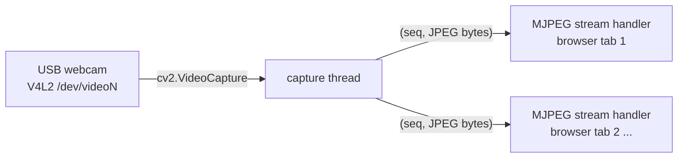

# USB webcam livestream

`usb_cam_stream` captures a USB webcam and serves it as a live MJPEG video
stream over plain HTTP — open a browser on any device on the network and
watch, with no RViz, no ROS install, no plugins, and no login needed on
the viewing device.

```
ros2 launch usb_cam_stream usb_cam_stream_launch.py
```
then open `http://<car-ip>:9090/` in any browser on the same network
(find `<car-ip>` with `hostname -I` on the car, or use its Tailscale
address — see [Security note](#security-note) below). **Port `9090`, not
`8080`** — `web_dashboard` already listens on `8080` on this car.

This node has **no ROS subscriptions or publishers of its own** — it
talks directly to the camera over V4L2 and never touches `/drive` or any
other topic, so it carries zero risk to how the car drives and can be
left running at all times alongside anything else in this workspace.

## Picking a camera

Any **UVC-compliant** USB webcam works out of the box on Linux with no
driver install — that's the one hard requirement. Beyond that:

- Prefer a camera with an **onboard H.264/MJPEG hardware encoder**
  (Logitech C920/C920x, C922/C922x) — it sends already-compressed video
  over USB instead of raw YUYV, which matters because the Jetson is
  already running the rest of the driving stack. `camera_stream_node`
  asks for MJPEG from the camera itself (`CAP_PROP_FOURCC` set to
  `MJPG`) for exactly this reason, then re-encodes each frame to JPEG at
  its own configured quality for the actual browser-facing stream.
- 720p/1080p @ 30fps is plenty for a spectator/monitoring feed — there's
  no need for 60fps or 4K here, and higher resolutions cost more Jetson
  CPU on the JPEG re-encode step and more WiFi bandwidth per frame.
- A wide-FOV board camera (e.g. ELP-style USB modules, ~100–170°) gives a
  more usable "driver's view" than a standard ~78° webcam if the goal is
  seeing the track ahead, at the cost of no onboard hardware encoder on
  most of those modules.

## How it works



Three concurrency models share one process:

1. **rclpy's executor**, spun on a background thread purely so
   `ros2 param`/lifecycle introspection works on this node — it has no
   subscriptions or publishers of its own.
2. **A dedicated capture thread** that owns `cv2.VideoCapture` exclusively
   and continuously grabs + JPEG-encodes frames. This has to be its own
   thread because OpenCV's `.read()` blocks on I/O, and it must never run
   on Tornado's IOLoop thread (that would stall every connected browser
   for the duration of each camera read).
3. **Tornado's IOLoop**, owning the main thread, serving HTTP — including
   the long-lived multipart MJPEG response each connected browser tab
   keeps open (see [web-dashboard.md](web-dashboard.md) for why this
   workspace already standardized on Tornado for this kind of thing).

The capture thread and every stream handler only ever communicate through
one `(sequence number, JPEG bytes)` pair — a plain attribute write on the
capture thread, a plain attribute read on the IOLoop thread. Both are
atomic under the GIL, and a handler occasionally serving one frame late
is a non-issue for a live video feed, so no lock is used (same reasoning
as `_last_pose` etc. in `web_dashboard_node`).

### The wire format: MJPEG over HTTP, not WebRTC/RTSP

Each connected browser tab opens a single, never-ending HTTP response with
`Content-Type: multipart/x-mixed-replace`. The server keeps writing
`--boundary\r\nContent-Type: image/jpeg\r\n\r\n<jpeg bytes>\r\n` chunks
down that same connection for as long as the tab stays open, and the
browser natively redraws an `` tag with each new chunk — no
JavaScript at all is required on the browser side (see `web/index.html`).

This is deliberately **not** WebRTC or RTSP: those get meaningfully lower
latency but need a signaling server / real-time transport stack for a
genuinely marginal win here, since this is a monitoring/spectator feed,
not a teleoperation control loop. MJPEG's few-hundred-ms latency is a
reasonable trade for "zero moving parts, works in literally any browser,
embeddable with one `` tag."

## Running it

```bash
source /opt/ros/jazzy/setup.bash && source ~/racerbot-ws/install/setup.bash
ros2 launch usb_cam_stream usb_cam_stream_launch.py
```
Then open `http://<car-ip>:9090/`. This node doesn't touch `/drive`, so
none of the joystick-override or wheels-off-ground precautions in
[operations.md](operations.md) apply to it — it's safe to start and stop
at any time, on top of anything else.

To point it at a different camera, resolution, or port, edit
`src/usb_cam_stream/config/usb_cam_stream.yaml` — see the
[parameter reference](#parameter-reference) below.

If the camera isn't found or gets unplugged, the capture thread logs an
error and keeps retrying every few seconds rather than crashing the node
— check `v4l2-ctl --list-devices` to confirm the device path.

## Parameter reference

All in `src/usb_cam_stream/config/usb_cam_stream.yaml`:

| Parameter | Default | Meaning |
|---|---|---|
| `device` | `/dev/video0` | V4L2 device path (or a bare index like `0`) — verify with `v4l2-ctl --list-devices`, especially if more than one video device is ever plugged in |
| `width` / `height` | `1280` / `720` | Requested capture resolution — actual resolution falls back to the camera's nearest supported mode if this exact one isn't available |
| `capture_fps` | `30` | Requested camera capture rate |
| `host` | `0.0.0.0` | Listen on every network interface — see [security note](#security-note) |
| `port` | `9090` | Web server port — **not** `8080`, which `web_dashboard` already uses on this car |
| `stream_fps` | `15.0` | How often each connected browser is sent a new frame — independent of `capture_fps`, keeps WiFi/CPU load down since a browser doesn't need every captured frame |
| `jpeg_quality` | `80` | `0`–`100` JPEG re-encode quality — higher costs more bandwidth/CPU per frame |

## Security note

This stream has **no authentication** and serves plain, unencrypted HTTP.
That's a reasonable trade-off for a video-only feed that never accepts
input and can never be used to *command* the car — but it does mean
anyone who can reach `<car-ip>:9090` on the network can watch. Don't
port-forward this to the open internet. For remote-but-still-private
access, this machine already has a `tailscale0` interface configured (see
[hardware-reference.md](hardware-reference.md)) — use the car's Tailscale
address instead of exposing the port publicly.

## Limitations

- **No audio.** Video only — MJPEG-over-HTTP has no audio channel; adding
  audio would need a genuinely different transport (e.g. WebRTC).
- **No recording.** This streams live only; nothing is written to disk.
- **Single camera.** One `usb_cam_stream_node` instance drives one device;
  running a second camera means launching a second instance of this node
  with a different `device` and `port`.
- **Not a low-latency control feed.** A few hundred ms of MJPEG latency is
  fine for monitoring/spectating, not for anything steering-loop-adjacent.

## File map

```
src/usb_cam_stream/
├── usb_cam_stream/
│   └── camera_stream_node.py   # capture thread + Tornado MJPEG server
├── web/
│   └── index.html              # entire browser side: one  tag
├── config/usb_cam_stream.yaml
└── launch/usb_cam_stream_launch.py
```
