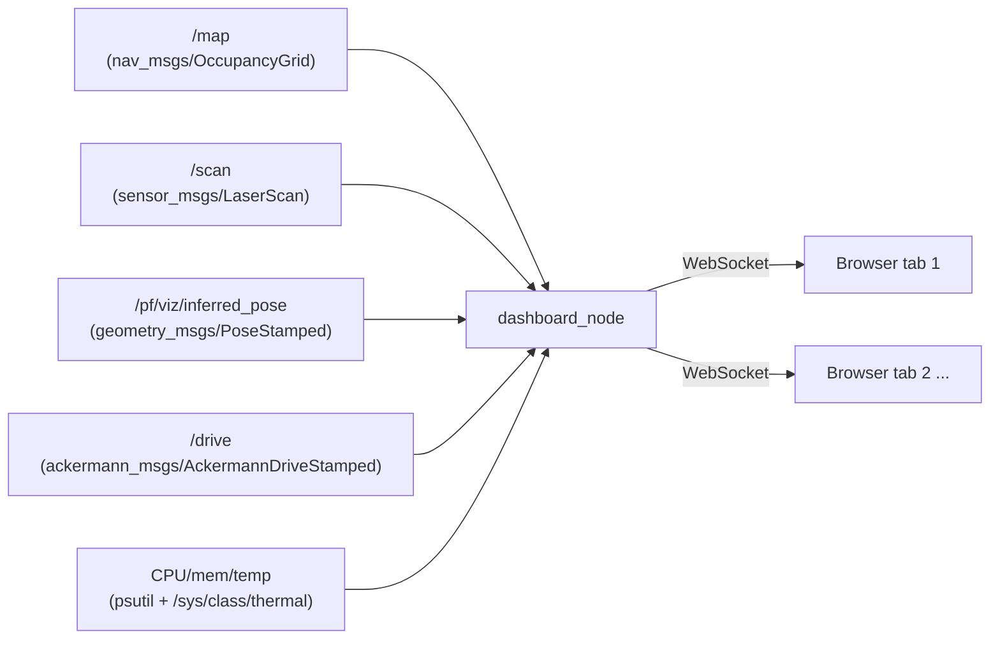

# Live web dashboard: see what the car sees

`web_dashboard` streams the car's SLAM/localization map, its raw LIDAR
scan, its own pose, the currently-arbitrated `/drive` command, and coarse
system health (CPU/mem/temp/WiFi/uptime) to a plain web page, live, over
the LAN — open a browser on a laptop or phone and watch the map build
during SLAM, or watch the car's position and LIDAR returns during
localization/racing, with no RViz, no ROS install, and no login needed on
the viewing device. A corner inset also embeds the live camera feed from
[`usb_cam_stream`](../src/usb_cam_stream/README.md), if that node is
running. This is the reference example of "support/tooling code" in
[adding-your-own-code.md](adding-your-own-code.md) — see that doc first if
you're adding something similar.

This doc covers the workflow, what you'll see, and how the pieces fit
together; for a line-by-line code walkthrough (the wire protocol, every
parameter, the thread-bridging pattern) see
[src/web_dashboard/README.md](../src/web_dashboard/README.md).

```
source /opt/ros/jazzy/setup.bash && source ~/racerbot-ws/install/setup.bash
ros2 launch web_dashboard web_dashboard_launch.py
```
then open `http://<car-ip>:8080/` in any browser on the same network (find
`<car-ip>` with `hostname -I` on the car, or use its Tailscale address —
see [Security note](#security-note) below). No other node needs to be
running first — see the table below for what you'll see at each stage;
worst case with nothing else up yet, the page just shows "no scan yet."

This node is **entirely passive** — it only ever subscribes, it never
publishes anything, to `/drive` or any other topic. That means the
workspace's [mandatory LB-deadman policy](architecture.md#workspace-policy-the-lb-deadman-button-is-mandatory-for-every-node-that-can-move-the-car)
does not apply to it (that policy is scoped to nodes that can *move the
car* — see [writing-your-own-node.md](writing-your-own-node.md#the-interface-contract)):
there's nothing here for a deadman check to gate. It carries zero risk to
how the car drives and can be left running at all times, alongside
anything else in this workspace: `bringup_launch.py`, SLAM, localization,
`gap_follow`, `pure_pursuit`, all of it.

## What you'll actually see

The dashboard degrades gracefully depending on what's running, so it's
useful at every stage of [operations.md](operations.md), not just once
everything is fully set up:

| Running | What the dashboard shows |
|---|---|
| Just `/scan` (LIDAR driver only) | **Robot-centric mode**: the car fixed at the center of the screen, always facing "up", with the raw LIDAR points drawn around it exactly as the beams came in. No map, no localization needed — this is literally "what the car is seeing," live. |
| `/scan` + `slam_toolbox` mapping | The map builds and updates live in the background as you drive; the scan stays robot-centric (see [Limitations](#limitations) for why the overlay doesn't lock onto the map during live SLAM specifically). |
| `/scan` + a saved map + `particle_filter` localized (seeded with RViz's "2D Pose Estimate") | **Map-relative mode**: the map is the background, the car is drawn at its real localized position and heading, and the LIDAR points are drawn in true world coordinates — so you can directly see where the car is relative to the walls, other objects, and the rest of the track. |

To get just `/scan` publishing, without the rest of the hardware layer
(no `joy_node`, VESC, or `ackermann_mux` — those only come bundled
together via `bringup_launch.py`), run the LIDAR driver directly with the
same config `bringup_launch.py` uses:

```bash
source /opt/ros/jazzy/setup.bash && source ~/racerbot-ws/install/setup.bash
ros2 run urg_node urg_node_driver --ros-args --params-file src/f1tenth_system/f1tenth_stack/config/sensors.yaml
```

The Hokuyo is Ethernet-connected (see
[hardware-reference.md](hardware-reference.md#lidar--hokuyo-ust-10lx)), so
if this is a fresh boot and the `hokuyo` NetworkManager profile hasn't
auto-connected yet, bring it up first: `nmcli connection up hokuyo`, then
confirm with `ping 192.168.0.10`.

## How it works



One ROS2 node (`dashboard_node.py`) does two jobs in one process:

1. **Subscribes** to the map, scan, pose, and drive topics, exactly like any
   other node in this workspace, and separately samples system stats
   (CPU/mem/temp/uptime) on a timer rather than from a topic.
2. **Runs a small web server** ([Tornado](https://www.tornadoweb.org/), a
   mature, single-dependency Python library that already ships on this
   machine) that serves the dashboard's HTML/JS/CSS as static files, and
   pushes every update out to any connected browser tab over a WebSocket.

Subscribing to `/drive` only ever *reads* the current command for display
— this node still never publishes anything, so it remains just as safe to
leave running as before; see the [security note](#security-note).

### Two concurrency models sharing one process

rclpy's executor (which calls this node's subscription callbacks) and
Tornado's IOLoop (which runs the web server) don't share a thread by
default. This node spins rclpy on a background thread and lets Tornado's
IOLoop own the main thread; every subscription callback hands its update
to the IOLoop via `add_callback()` (Tornado's documented thread-safe
hand-off) instead of ever touching a WebSocket connection directly from
the ROS thread. See the comments at the top of `dashboard_node.py` for the
full reasoning — this is a genuinely reusable pattern any time you need to
bridge rclpy to an asyncio-based library.

### The wire protocol

Sending a 2000×2000-cell occupancy grid as a JSON array of numbers would
be enormous and slow to parse. Instead, every update travels as **one JSON
text message** (metadata — "here's what's coming and how to read it"),
immediately followed by **one binary message** (the raw payload), chosen
to match a JavaScript `TypedArray` byte-for-byte so the browser does zero
manual parsing:

| Update | JSON header | Binary payload |
|---|---|---|
| Map | width, height, resolution, origin | `Int8Array` — one signed byte per cell, exactly matching `OccupancyGrid.data` (-1 unknown, 0 free, 100 occupied) |
| Scan | angle range/increment, LIDAR mounting offset | `Float32Array` — one little-endian float per beam, exactly matching `LaserScan.ranges` |
| Pose | `{x, y, yaw}` | *(none — small enough to just be JSON)* |
| Drive | `{speed, steering_angle}` | *(none)* |
| Stats | `{cpu_percent, mem_percent, cpu_temp_c, uptime_s, wifi_dbm}` | *(none — `cpu_temp_c`/`wifi_dbm` are `null` if no readable thermal zone / wireless interface was found)* |

All of this conversion lives in `web_dashboard/protocol.py`, deliberately
kept free of any ROS/Tornado/network imports so it's directly
unit-testable (`test/test_protocol.py`) without a running robot, browser,
or web server.

### The browser side

`web/dashboard.js` is one plain file, no build step, no framework:
connects to `ws://<host>/ws`, keeps the latest map/scan/pose/drive/stats in
a small state object, and redraws an HTML5 `<canvas>` whenever new data
arrives (plus on a 250ms timer, purely so "updated Xs ago" and stale-data
coloring stay live even when nothing new has arrived). The occupancy grid
is rendered into an off-screen canvas once per map update (not once per
frame) and then scaled onto the visible canvas with a single `drawImage()`
call — redrawing every cell every frame would be needlessly slow for a
large map. Drag to pan (works both before and after localization — see
below), scroll to zoom (toward the cursor), "reset view" to re-fit.

Robot-centric mode (no pose yet) and map-relative mode (once localized)
use two different coordinate transforms (`bodyToCanvas` vs
`worldToCanvas`), so panning/zooming tracks its own offset in each —
`view.bodyPanX/bodyPanY` for the former, `view.centerX/centerY` for the
latter — rather than sharing one, since a drag that happened before
localization has no meaningful world-frame equivalent to carry over.

The car itself is drawn as a small top-down car silhouette (rounded body,
wheels, a lighter "windshield" stripe marking the front) rather than a
bare arrow, so heading reads unambiguously even at a glance. A translucent
red wedge marks the LIDAR's actual blind spot — the arc it physically
never scans (e.g. the Hokuyo's ~270° field of view leaves a real ~90° gap
behind its mount) — computed from the scan's own
`angle_min`/`angle_increment`/count, not guessed from which beams read "no
return" this frame (open space with nothing in range would look identical
to a blind spot that way, and shouldn't be flagged as one). A scale bar in
the bottom-left corner shows the current zoom level in meters/cm.

### Layout

- **Left sidebar** — connection status, then a `feeds` section (map,
  scan, pose, drive, each with a small status dot: gray = never received,
  green = updating, red = stale) and a `system` section (CPU%, mem%, CPU
  temp, WiFi signal, uptime). It has no fixed/maximum height — it simply
  grows to fit whatever rows it has, rather than cramming them into a
  fixed box.
- **Top-right inset** — a minimap: always shows the *whole* map at a
  fixed auto-fit scale, independent of the main canvas's own pan/zoom,
  with a white rectangle showing what the main view currently frames and
  a small marker for the car — so zooming into one corner of the track on
  the main canvas doesn't lose the big picture. Shows a placeholder until
  a map has arrived.
- **Bottom-right inset** — the live camera feed, if
  [`usb_cam_stream`](../src/usb_cam_stream/README.md) is running. This is
  a completely separate node on its own port (`9090`) — the browser just
  points an `` at `http://<car-ip>:9090/stream` directly (an MJPEG
  stream is a plain, never-ending HTTP response; no WebSocket, no JSON
  frame). If that node isn't running, the inset shows a "camera offline"
  placeholder and retries the connection every 3 seconds — no need to
  reload the dashboard page once the camera node starts.

## Running it

```bash
source /opt/ros/jazzy/setup.bash && source ~/racerbot-ws/install/setup.bash
ros2 launch web_dashboard web_dashboard_launch.py
```
Then open `http://<car-ip>:8080/`. That's the entire procedure — this
node reads `/drive` only to display it and never publishes anything to
it (or any other topic), so none of the joystick-override or
wheels-off-ground precautions in [operations.md](operations.md) apply to
it; it's safe to start and stop at any time, on top of anything else.

To point it at different topics (e.g. testing against a bag file) or a
different port, edit `src/web_dashboard/config/web_dashboard.yaml` — see
the [parameter reference](#parameter-reference) below.

## Parameter reference

All in `src/web_dashboard/config/web_dashboard.yaml`:

| Parameter | Default | Meaning |
|---|---|---|
| `map_topic` | `/map` | Subscribed with "transient local" durability to match `map_server`/`slam_toolbox`, so a dashboard started after the map was published still receives it |
| `scan_topic` | `/scan` | Subscribed with best-effort sensor QoS |
| `pose_topic` | `/pf/viz/inferred_pose` | `particle_filter`'s localized pose |
| `drive_topic` | `/drive` | Whichever control layer is currently arbitrated onto `/drive` (see [architecture.md](architecture.md)) — read-only, purely for the `drive` readout |
| `host` | `0.0.0.0` | Listen on every network interface — see [security note](#security-note) |
| `port` | `8080` | Web server port |
| `scan_broadcast_rate_hz` | `10.0` | `/scan` runs ~40Hz; no browser needs to redraw that often, and this keeps WiFi/CPU load down |
| `stats_interval_sec` | `1.0` | How often CPU%/mem%/temp/uptime are sampled and broadcast |
| `laser_offset_x` / `laser_offset_y` | `0.27` / `0.0` | LIDAR mounting offset from `base_link` (matches [hardware-reference.md](hardware-reference.md)), used to place scan points correctly relative to the car's pose |

## Security note

This dashboard has **no authentication** and accepts WebSocket connections
from any origin. That's a deliberate, reasonable trade-off for a read-only
tool that never publishes anything and therefore can never be used to
*command* the car — but it does mean anyone who can reach `<car-ip>:8080`
on the network can see the map/scan/pose, the currently-arbitrated drive
command, coarse system stats (CPU/mem/temp/WiFi/uptime), and — if
`usb_cam_stream` is running — the camera feed. Don't port-forward this to
the open internet. For remote-but-still-private access, this machine
already has a `tailscale0` interface configured (see
[hardware-reference.md](hardware-reference.md)) — use the car's Tailscale
address instead of exposing the port publicly.

## Limitations

- **Live SLAM mapping shows the map, but the scan/car overlay stays
  robot-centric, not locked to the map.** During live `slam_toolbox`
  mapping (before you've saved a map and started `particle_filter`),
  there's no simple pose *topic* publishing the car's position in the map
  frame — `slam_toolbox` publishes that relationship as a `map`→`odom` TF
  transform instead, which this node deliberately doesn't subscribe to,
  to keep its dependency footprint small (no `tf2_ros` buffer/listener).
  Point `pose_topic` at a topic that publishes a live map-frame pose (this
  workspace's `particle_filter` is the simplest way to get one) for a
  fully map-locked overlay.
- **No rotated map origins.** The renderer assumes the map's origin
  orientation is identity (true for every map this workspace's tooling
  produces); a map saved with a rotated origin would render misaligned.
- **Camera port (`9090`) is hardcoded in `dashboard.js`** (`CAMERA_PORT`),
  not a `config/web_dashboard.yaml` parameter — it's the browser, not
  `dashboard_node`, that connects to the camera stream directly, so this
  is a JS constant, not a launch-time ROS parameter. Edit it directly if
  `usb_cam_stream` is ever reconfigured to a different port.
- Exactly one shared view per browser tab — there's no multi-car, no
  recording/playback. It does one job (see what the LIDAR, localization,
  drive command, system health, and camera currently say) and does it
  with almost no moving parts.

## File map

```
src/web_dashboard/
├── web_dashboard/
│   ├── protocol.py          # wire-format conversion, framework-agnostic, unit-tested
│   └── dashboard_node.py    # ROS2 node + Tornado web/WebSocket server
├── web/
│   ├── index.html
│   ├── dashboard.js         # canvas rendering, pan/zoom, staleness display
│   └── style.css
├── config/web_dashboard.yaml
├── launch/web_dashboard_launch.py
└── test/test_protocol.py    # run: python3 -m pytest src/web_dashboard/test/ -v
```
