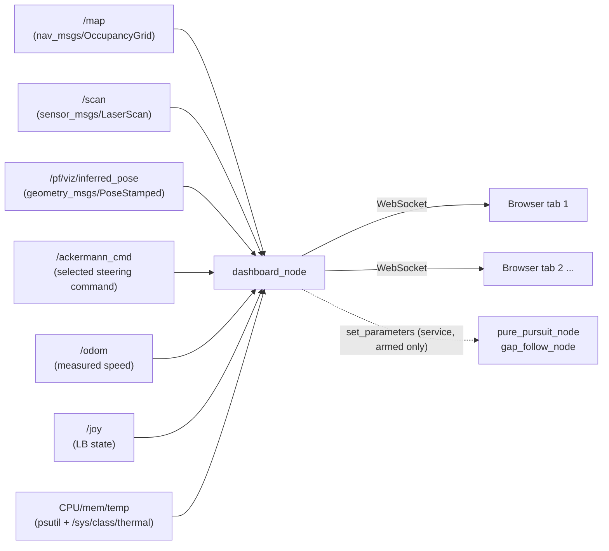

# Live web dashboard: see what the car sees

`web_dashboard` streams the car's SLAM/localization map, proximity-colored
LIDAR, pose, measured `/odom` speed, selected `/ackermann_cmd` steering, LB
state/stopwatch, and coarse system health (CPU/mem/temp/WiFi/uptime) live over
the LAN — open a browser on a laptop or phone and watch the map build
during SLAM, or watch the car's position and LIDAR returns during
localization/racing, with no RViz, no ROS install, and no login needed on
the viewing device. A corner inset also embeds the live camera feed from
[`usb_cam_stream`](../src/usb_cam_stream/README.md), if that node is
running. A [live tuning panel](#live-parameter-tuning) can also adjust a
running driving node's speeds and safety margins from the same page. This
is the reference example of "support/tooling code" in
[adding-your-own-code.md](adding-your-own-code.md) — see that doc first if
you're adding something similar.

This doc covers the workflow, what you'll see, and how the pieces fit
together; for a line-by-line code walkthrough (the wire protocol, every
parameter, the thread-bridging pattern) see
[src/web_dashboard/README.md](../src/web_dashboard/README.md).

```
source /opt/ros/jazzy/setup.bash && source ~/racerbot-ws/install/setup.bash
ros2 launch web_dashboard web_dashboard_launch.py
```
then open `http://<car-ip>:8080/` in any browser on the same network (find
`<car-ip>` with `hostname -I` on the car, or use its Tailscale address —
see [Security note](#security-note) below). No other node needs to be
running first — see the table below for what you'll see at each stage;
worst case with nothing else up yet, the page just shows "no scan yet."

This node **publishes to no ROS topic at all** — not `/drive`, not
`/ackermann_cmd`, not anything. It cannot steer, accelerate, or brake the
car, so the workspace's [mandatory LB-deadman policy](architecture.md#workspace-policy-the-lb-deadman-button-is-mandatory-for-every-node-that-can-move-the-car)
does not apply to it (that policy is scoped to nodes that can *move the
car* — see [writing-your-own-node.md](writing-your-own-node.md#the-interface-contract)):
there's no driving output for a deadman check to gate. Reading LB only gates
the stopwatch. It can be left running at all times, alongside anything else
in this workspace: `bringup_launch.py`, SLAM, localization, `gap_follow`,
`pure_pursuit`, all of it.

It is not, however, purely a *viewer* any more.
[Live parameter tuning](#live-parameter-tuning) (on by default) lets it call
the standard `/<node>/set_parameters` service on this workspace's driving
nodes, so you can change speeds, lookahead, and safety margins from a phone
between runs instead of editing YAML and relaunching. That is a real path
to the car and is documented as such below — read that section and the
[security note](#security-note) before using it at a shared venue. Set
`enable_tuning: false` for the strictly-read-only dashboard.

## What you'll actually see

The dashboard degrades gracefully depending on what's running, so it's
useful at every stage of [operations.md](operations.md), not just once
everything is fully set up:

| Running | What the dashboard shows |
|---|---|
| Just `/scan` (LIDAR driver only) | **Robot-centric mode**: the car fixed at the center of the screen, always facing "up", with the raw LIDAR points drawn around it exactly as the beams came in. No map, no localization needed — this is literally "what the car is seeing," live. |
| `/scan` + `slam_toolbox` mapping | The map builds and updates live in the background as you drive; the scan stays robot-centric (see [Limitations](#limitations) for why the overlay doesn't lock onto the map during live SLAM specifically). |
| `/scan` + a saved map + `particle_filter` localized (seeded with RViz's "2D Pose Estimate") | **Map-relative mode**: the map is the background, the car is drawn at its real localized position and heading, and the LIDAR points are drawn in true world coordinates — so you can directly see where the car is relative to the walls, other objects, and the rest of the track. |

To get just `/scan` publishing, without the rest of the hardware layer
(no `joy_node`, VESC, or `ackermann_mux` — those only come bundled
together via `bringup_launch.py`), run the LIDAR driver directly with the
same config `bringup_launch.py` uses:

```bash
source /opt/ros/jazzy/setup.bash && source ~/racerbot-ws/install/setup.bash
ros2 run urg_node urg_node_driver --ros-args --params-file src/f1tenth_system/f1tenth_stack/config/sensors.yaml
```

The Hokuyo is Ethernet-connected (see
[hardware-reference.md](hardware-reference.md#lidar--hokuyo-ust-10lx)), so
if this is a fresh boot and the `hokuyo` NetworkManager profile hasn't
auto-connected yet, bring it up first: `nmcli connection up hokuyo`, then
confirm with `ping 192.168.0.10`.

## How it works


```mermaid
flowchart LR
    M["/map\n(nav_msgs/OccupancyGrid)"] --> N[dashboard_node]
    S["/scan\n(sensor_msgs/LaserScan)"] --> N
    P["/pf/viz/inferred_pose\n(geometry_msgs/PoseStamped)"] --> N
    D["/ackermann_cmd\n(selected steering command)"] --> N
    O["/odom\n(measured speed)"] --> N
    J["/joy\n(LB state)"] --> N
    T["CPU/mem/temp\n(psutil + /sys/class/thermal)"] --> N
    N -- WebSocket --> B1[Browser tab 1]
    N -- WebSocket --> B2[Browser tab 2 ...]
    N -. "set_parameters (service, armed only)" .-> D1["pure_pursuit_node\ngap_follow_node"]
```

One ROS2 node (`dashboard_node.py`) does two jobs in one process:

1. **Subscribes** to map, scan, pose, selected command, odometry, and joy
   topics, exactly like any other node, and separately samples system stats
   (CPU/mem/temp/uptime) on a timer rather than from a topic.
2. **Runs a small web server** ([Tornado](https://www.tornadoweb.org/), a
   mature, single-dependency Python library that already ships on this
   machine) that serves the dashboard's HTML/JS/CSS as static files, and
   pushes every update out to any connected browser tab over a WebSocket.

These subscriptions only feed displays and the dashboard-local stopwatch.
The node publishes to no topic; enabling/resetting the stopwatch changes no
car state. The one thing that does reach the car is
[live parameter tuning](#live-parameter-tuning), which is a *service*
client, not a publisher, and is gated as described there; see also the
[security note](#security-note).

### Two concurrency models sharing one process

rclpy's executor (which calls this node's subscription callbacks) and
Tornado's IOLoop (which runs the web server) don't share a thread by
default. This node spins rclpy on a background thread and lets Tornado's
IOLoop own the main thread; every subscription callback hands its update
to the IOLoop via `add_callback()` (Tornado's documented thread-safe
hand-off) instead of ever touching a WebSocket connection directly from
the ROS thread. See the comments at the top of `dashboard_node.py` for the
full reasoning — this is a genuinely reusable pattern any time you need to
bridge rclpy to an asyncio-based library.

### The wire protocol

Sending a 2000×2000-cell occupancy grid as a JSON array of numbers would
be enormous and slow to parse. Instead, every update travels as **one JSON
text message** (metadata — "here's what's coming and how to read it"),
immediately followed by **one binary message** (the raw payload), chosen
to match a JavaScript `TypedArray` byte-for-byte so the browser does zero
manual parsing:

| Update | JSON header | Binary payload |
|---|---|---|
| Map | width, height, resolution, origin | `Int8Array` — one signed byte per cell, exactly matching `OccupancyGrid.data` (-1 unknown, 0 free, 100 occupied) |
| Scan | angle range/increment, LIDAR mounting offset | `Float32Array` — one little-endian float per beam, exactly matching `LaserScan.ranges` |
| Pose | `{x, y, yaw}` | *(none — small enough to just be JSON)* |
| Drive | selected-command `{speed, steering_angle}` | *(none)* |
| Speed | measured `{speed}` from odometry | *(none)* |
| Stopwatch | elapsed/enabled/running plus LB/freshness flags | *(none)* |
| Stats | `{cpu_percent, mem_percent, cpu_temp_c, uptime_s, wifi_dbm}` | *(none — `cpu_temp_c`/`wifi_dbm` are `null` if no readable thermal zone / wireless interface was found)* |
| Tuning | the whole panel: per node, whether it's up, its advertised catalogue, and every current value | *(none)* |
| Tuning result / saved / armed | outcome of one change, of a save, and this connection's arm state | *(none)* |

All of this conversion lives in `web_dashboard/protocol.py`, deliberately
kept free of any ROS/Tornado/network imports so it's directly
unit-testable (`test/test_protocol.py`) without a running robot, browser,
or web server.

### The browser side

`web/dashboard.js` is one plain file, no build step, no framework:
connects to `ws://<host>/ws`, keeps the latest map/scan/pose/command/speed/
stopwatch/stats in a small state object, and redraws an HTML5 `<canvas>` whenever data
arrives (plus on a 250ms timer, purely so "updated Xs ago" and stale-data
coloring stay live even when nothing new has arrived). The occupancy grid
is rendered into an off-screen canvas once per map update (not once per
frame) and then scaled onto the visible canvas with a single `drawImage()`
call — redrawing every cell every frame would be needlessly slow for a
large map. Drag to pan (works both before and after localization — see
below), scroll to zoom (toward the cursor), "reset view" to re-fit.

The map is drawn in the dashboard's own dark palette rather than the
ROS/RViz convention of white free space on mid-gray unknown, which on this
UI looked like a lit-up slab pasted over the page and washed out the scan
drawn on top of it. The polarity is inverted instead: **unknown** fades
almost completely into the page background, **free space** is a dark slate
"track surface", and **occupied cells** are the bright end — a desaturated
blue-gray, so walls stay the most legible thing in the map without
competing with the saturated red→green LIDAR points or the red car icon.
Cells between free and occupied interpolate between the two. Since unknown
area fades out, a one-pixel hairline (the same `#263140` every panel border
uses) marks the grid's extent. All three colors are constants at the top of
`applyMap()`'s section in `dashboard.js` if the theme ever changes.

Robot-centric mode (no pose yet) and map-relative mode (once localized)
use two different coordinate transforms (`bodyToCanvas` vs
`worldToCanvas`), so panning/zooming tracks its own offset in each —
`view.bodyPanX/bodyPanY` for the former, `view.centerX/centerY` for the
latter — rather than sharing one, since a drag that happened before
localization has no meaningful world-frame equivalent to carry over.

The car itself is drawn as a small top-down car silhouette (rounded body,
wheels, a lighter "windshield" stripe marking the front) rather than a
bare arrow, so heading reads unambiguously even at a glance. A translucent
red wedge marks the LIDAR's actual blind spot — the arc it physically
never scans (e.g. the Hokuyo's ~270° field of view leaves a real ~90° gap
behind its mount) — computed from the scan's own
`angle_min`/`angle_increment`/count, not guessed from which beams read "no
return" this frame (open space with nothing in range would look identical
to a blind spot that way, and shouldn't be flagged as one). Valid returns
use a red→yellow→green proximity scale (0.3m near to 5m far). A scale bar in
the bottom-left corner shows the current zoom level in meters/cm.

### Layout

- **Left sidebar** — connection status; `feeds`; `vehicle` (measured speed,
  selected steering, LB state); an LB-gated stopwatch with enable/reset;
  `live tuning` (which driving nodes are tunable, and the button that
  opens the panel); and `system` health. Feed dots are gray = never received, green = fresh,
  red = stale. It has no fixed/maximum height — it simply
  grows to fit whatever rows it has, rather than cramming them into a
  fixed box.
- **Top-right inset** — a minimap: always shows the *whole* map at a
  fixed auto-fit scale, independent of the main canvas's own pan/zoom,
  with a rectangle in the UI's accent blue showing what the main view
  currently frames and a small marker for the car — so zooming into one
  corner of the track on the main canvas doesn't lose the big picture.
  Shows a placeholder until a map has arrived.
- **Bottom-right inset** — the live camera feed, if
  [`usb_cam_stream`](../src/usb_cam_stream/README.md) is running. This is
  a completely separate node on its own port (`9090`) — the browser just
  points an `` at `http://<car-ip>:9090/stream` directly (an MJPEG
  stream is a plain, never-ending HTTP response; no WebSocket, no JSON
  frame). If that node isn't running, the inset shows a "camera offline"
  placeholder and retries the connection every 3 seconds — no need to
  reload the dashboard page once the camera node starts. Either variant of
  that node fills this panel: `usb_cam_stream_launch.py` (a UVC webcam) or
  `realsense_stream_launch.py` (the RealSense D435i's color feed, via its
  ROS topic — see [realsense-camera.md](realsense-camera.md)); they share
  port 9090, so run one at a time. Click the inset to open a new full-window
  recording tab with current time, speed, steering, LB, stopwatch, CPU, and
  WiFi overlays; use the browser's tab/screen recording on that view.

  **Resizing it:** hover the inset and a grip appears in its top-left
  corner (where the "camera" label normally sits) — drag it to make the
  feed as large or as small as you want, double-click it to go back to the
  default size. The panel is pinned to the bottom-right corner, so that's
  the only corner that can move. Dragging *scales* the panel along the
  stream's own aspect ratio rather than reshaping it freely, so the inset
  is always exactly the shape of the frame: the whole image is visible at
  every size, never cropped and never letterboxed. It won't grow over the
  sidebar or up into the minimap, and the size is remembered in the
  browser's `localStorage` (per browser, not per session — the car doesn't
  know about it). Dragging the grip never opens the recording tab, even
  though the rest of the panel is a link.

### The recording view (`camera.html`)

Clicking the camera inset opens this in a new tab: the camera feed as the
whole page, with a compact telemetry overlay (clock, speed, steering, LB,
stopwatch, CPU, WiFi) in the top-left. It's meant to be captured with the
browser's or OS's own screen recorder.

By default the frame is letterboxed — the entire image is visible, with
dark bars wherever the window's shape and the camera's disagree, which is
what you want while framing a shot. **Fullscreen fills the screen with no
bars at all:** click `fullscreen` in the top-right, press `F`, or
double-click the video. The frame is scaled up until it covers the screen
and whatever overflows the edges is cropped — it's never stretched, since
a distorted frame would misrepresent how far away things are. `F` again or
`Esc` leaves fullscreen and returns to the whole-frame view.

The fullscreen button and the mouse cursor both fade out after ~2.5s of no
input, so neither ends up baked into a recording; any mouse movement or
keypress brings them back.

## Running it

Dashboard by itself — map/scan/pose, no camera:
```bash
source /opt/ros/jazzy/setup.bash && source ~/racerbot-ws/install/setup.bash
ros2 launch web_dashboard web_dashboard_launch.py
```
Then open `http://<car-ip>:8080/` (see
[Finding the car's address](#finding-the-cars-address-and-viewing-through-a-forwarded-port)
below if you're not sure what to put there). That's the entire procedure
for the dashboard alone — this node reads command/odom/joy only for display
and its local stopwatch, and publishes to no topic, so none of the
joystick-override or wheels-off-ground precautions in
[operations.md](operations.md) apply to *starting* it; it's safe to start
and stop at any time, on top of anything else. (Changing a driving node's
parameters from its tuning panel is a different matter — see
[Live parameter tuning](#live-parameter-tuning).)

To point it at different topics (e.g. testing against a bag file) or a
different port, edit `src/web_dashboard/config/web_dashboard.yaml` — see
the [parameter reference](#parameter-reference) below.

### With the camera panel filled in too

Two terminals, each sourced the same way as above
(`source /opt/ros/jazzy/setup.bash && source ~/racerbot-ws/install/setup.bash`).
Order doesn't matter — all components are support/tooling nodes (see
[adding-your-own-code.md](adding-your-own-code.md)), none of them touch
`/drive`, so there's no bringup sequencing or LB-deadman precaution to
follow here, unlike the driving-code procedures in
[operations.md](operations.md):

```bash
# Terminal 1 — RealSense driver + color-topic MJPEG stream on port 9090
ros2 launch racerbot_launch realsense_camera_launch.py

# Terminal 2 — dashboard and recording view on port 8080
ros2 launch web_dashboard web_dashboard_launch.py
```

Then open `http://<car-ip>:8080/`. If the camera panel still says "camera
offline" after a few seconds, it's almost always the forwarded-port issue
below, not a launch-order problem — the panel retries its connection every
3 seconds on its own, so a blank/offline panel that never fills in (rather
than one that briefly says offline before connecting) is the tell.

### One-shot bundle for testing: LiDAR + camera + dashboard, no driving

`racerbot_launch/launch/dashboard_test_launch.py` bundles the above three
nodes *and* a standalone `urg_node` (LiDAR, so the `/scan` panel fills in
too) into one launch — everything the dashboard can show, minus the
VESC/joy/`ackermann_mux` driving stack from `bringup_launch.py`. Same
support/tooling category as the three nodes above, so no LB-deadman check
and no bringup ordering to worry about:

```bash
ros2 launch racerbot_launch dashboard_test_launch.py
```

Then open `http://<car-ip>:8080/`. This is for bench-testing the
dashboard/sensors only — for actual driving, use `bringup_launch.py` plus
a control layer as usual, and `web_dashboard_launch.py` on its own if you
also want the dashboard up alongside them (see
[operations.md](operations.md)).

### Finding the car's address, and viewing through a forwarded port

**Use the car's real network address, not `localhost`, whenever you can.**
On the car:
```bash
hostname -I
```
lists every address the car currently has — the LAN one (e.g. `192.168.x.x`,
see [hardware-reference.md#network](hardware-reference.md#network)) works
from any device on the same network; the Tailscale one (`100.x.x.x`, same
section) works from anywhere Tailscale is set up, including off-network.
Either one, browsed directly, is the normal/intended way to use this
dashboard — from a laptop or phone, no code editor involved.

**If you're instead viewing through an editor's port-forwarding feature**
(e.g. VS Code's Ports panel showing `localhost:8080` in your browser's
address bar because it tunneled port 8080 from the car to your machine):
the dashboard's map/scan/pose/system stats all still work fine, because
they travel over the one WebSocket connection to that same forwarded
origin. **The camera panel is the exception** — `dashboard.js` makes your
*browser* open a second, independent HTTP connection straight to
`<the address in your address bar>:9090` (see `CAMERA_PORT` in
`dashboard.js`), substituting whatever hostname is currently in the URL.
If that hostname is `localhost` because of a tunnel, your browser tries
`localhost:9090` on *your own laptop* — which is nothing, since only port
8080 was forwarded — and the panel shows "camera offline" even though
everything on the car is running correctly.

Two ways to fix it:
1. **Browse the car's real address instead** (`hostname -I` above) — the
   camera panel then resolves `9090` against that same real address and
   just works. This is the simplest fix and matches how the dashboard is
   meant to be used.
2. **Or forward port `9090` too**, in addition to `8080`, using the same
   mechanism (e.g. VS Code's Ports panel → "Forward a Port" → `9090`). The
   panel's own 3-second retry picks it up automatically — no page reload
   needed.

This isn't specific to the camera panel or this dashboard — any tool here
that has a browser make a *second* connection to a *different* port than
the one you loaded the page from will hit the same issue under
port-forwarding. The camera panel is just the one place in this workspace
that currently does that.

## Live parameter tuning

Open the **live tuning** panel from the sidebar to change a running
driving node's speeds, geometry, and safety margins without editing YAML
and relaunching. Values apply on the node's very next control tick, so you
can lower `max_speed`, feel the difference on the next lap, and put it
back — the loop that used to be "stop the car, Ctrl+C, edit a file,
rebuild, relaunch, re-seed localization" becomes a slider.

This is the only part of the dashboard that reaches the car, so it is
worth understanding exactly what it can and cannot do.

### What it can't do

- **It cannot move the car.** There is still no publisher to `/drive`
  here. The car moves because an autonomy node decided to, and only while
  the driver holds LB. Tuning changes *how* a moving car behaves; it can
  never start one.
- **It cannot relax the deadman.** `enable_deadman` is not tunable, from
  here or from `ros2 param set`, on any node — the driving nodes refuse it
  at runtime. The [workspace LB policy](architecture.md#workspace-policy-the-lb-deadman-button-is-mandatory-for-every-node-that-can-move-the-car)
  is a team decision, not a knob.
- **It cannot switch off `pure_pursuit`'s reactive safety net.** Its
  *thresholds* are tunable (a margin that's wrong for the track is a real
  thing to discover mid-session); `enable_lidar_safety` itself is not.
- **It cannot exceed a node's own limits.** Every tunable carries a hard
  min/max enforced inside the node that owns it, on every update. The
  dashboard's sliders stop at the same bounds, but that's only so the UI
  doesn't offer a value that will bounce — the authority is in the node,
  which is why a hand-rolled `ros2 param set` hits the same wall.
- **It cannot reach a teammate's code.** Only nodes named in
  `tuning_nodes` are ever probed, and they must additionally advertise a
  `live_tunable_spec` parameter to appear at all.

### Arming

Every control is inert until you flip **arm changes** at the top of the
panel, and it starts disarmed on **every page load** — a reload, a dropped
WiFi link, or a phone going to sleep all disarm it. That's enforced on the
server, per connection, not just greyed out in the browser, so a stale tab
or a hand-rolled WebSocket client is refused the same way.

### Safety margins are marked

Parameters that move a collision margin or an emergency stop are grouped
under a **Safety margins** heading in amber, with an amber accent on each
control. They're deliberately included — those are exactly the numbers
you'd want to correct after watching the car stop too early on a tight
section — but they should never be dragged with the same casualness as a
lap-time knob.

### Live-only, until you save

Changes live in the running node's memory. **Restart the node and it's
back to the config file**, which is the useful property: a tune that turns
out to be wrong is one Ctrl+C away from gone, and there's always a known
baseline. Each control shows a **↺** once it differs from the value the
node started with, which puts that single parameter back.

When a tune is worth keeping, **save tune to config files** writes it into
the package's YAML — `src/pure_pursuit/config/pure_pursuit.yaml` and
`src/gap_follow/config/gap_follow.yaml`, resolved through the
`--symlink-install` chain to the real, git-tracked sources. Only values
that actually differ from the file are written, and every comment,
blank line, and key order in those files is preserved, so the result is a
small diff you can read:

```bash
git diff src/gap_follow/config/gap_follow.yaml
```

Review it before committing — a saved tune is a change to the car's
defaults for everyone. Set `tuning_allow_save: false` to allow live
tuning but forbid writing to disk, which is a reasonable race-day setting.

### What's tunable

Each node advertises its own catalogue, so the panel is always in sync
with the code rather than a hardcoded list that rots. To read it from a
terminal:

```bash
ros2 param get /gap_follow_node live_tunable_spec
```

| Node | Groups |
|---|---|
| `pure_pursuit_node` | Speed (`max_speed`, `min_speed`, accel/braking, `max_lateral_accel`), Line following (lookahead trio, `max_steering_rate`), Avoidance, Overtaking, and Safety margins (`emergency_stop_distance`, `emergency_stop_clearance`, `safety_fov_deg`, `max_cross_track_error`) |
| `gap_follow_node` | Speed, Gap selection (`min_gap_distance`, `disparity_threshold`, `steering_gain`, …), and Safety margins (`max_braking_decel`, `safety_margin`, the forward reserve, TTC) |

The catalogues themselves — names, bounds, and the prose shown in the UI —
live in `src/pure_pursuit/pure_pursuit/live_tuning.py` and
`src/gap_follow/gap_follow/live_tuning.py`. Adding a parameter is a change
there, deliberately: it means picking a hard range and writing down what
the knob does, in code that gets reviewed.

### Why a node has to opt in

Both driving nodes read their parameters once at startup and cache them on
instance attributes, because re-reading a parameter at 40Hz in the control
loop would be pointless overhead. That means a plain `ros2 param set` on a
parameter the node doesn't explicitly handle *succeeds and changes
nothing*: the parameter server stores the new value, the control loop
keeps using the cached one, and a dashboard reading the value back would
cheerfully display `max_speed: 2.0` for a car still driving 4.0.

So the nodes now **refuse** any runtime parameter change they don't know
how to apply, instead of accepting it silently:

```
$ ros2 param set /gap_follow_node car_width 0.9
Setting parameter failed: 'car_width' cannot be changed while the node is
running. The control loop caches its parameters at startup, so accepting
this would change the reported value without changing how the car drives.
Restart the node with a new config to change it.
```

That's a deliberate tightening and applies to `ros2 param set` as much as
to the dashboard. Cross-parameter invariants are enforced the same way and
a rejected batch changes nothing at all — no half-applied speed limits:

```
$ ros2 param set /gap_follow_node min_speed 3.0
Setting parameter failed: min_speed (3) cannot exceed max_speed (1.5)
```

`pure_pursuit`'s existing runtime `waypoints_file` update (how
`auto_map_race_node` hands over a freshly generated racing line) is
unaffected.

### Testing a tune before trusting it

Same order as any other change to driving behavior
([writing-your-own-node.md](writing-your-own-node.md#testing-before-its-on-wheels)):
wheels off the ground first, then floor at low speed, then open space. A
slider makes a change *fast*, not *safe* — raising `max_speed` mid-session
deserves the same care as editing it in YAML would.

## Parameter reference

All in `src/web_dashboard/config/web_dashboard.yaml`:

| Parameter | Default | Meaning |
|---|---|---|
| `map_topic` | `/map` | Subscribed with "transient local" durability to match `map_server`/`slam_toolbox`, so a dashboard started after the map was published still receives it |
| `scan_topic` | `/scan` | Subscribed with best-effort sensor QoS |
| `pose_topics` | `[/pf/viz/inferred_pose, /slam_pose]` | Every map-frame pose source this car can run, subscribed at once: `particle_filter`'s localized pose, and the pose `auto_map_race_node` republishes from SLAM's `map`→`base_link` TF. One dashboard process therefore works across all stacks without a relaunch; last message wins |
| `drive_topic` | `/ackermann_cmd` | Selected command after `ackermann_mux`; steering display and command-speed reference only |
| `odom_topic` | `/odom` | Measured longitudinal speed |
| `joy_topic` / `deadman_button` / `joy_timeout_sec` | `/joy` / `4` / `0.5` | Read-only LB state and freshness watchdog for the stopwatch |
| `stopwatch_update_rate_hz` | `10.0` | Shared stopwatch state broadcast rate |
| `host` | `0.0.0.0` | Listen on every network interface — see [security note](#security-note) |
| `port` | `8080` | Web server port |
| `scan_broadcast_rate_hz` | `10.0` | `/scan` runs ~40Hz; no browser needs to redraw that often, and this keeps WiFi/CPU load down |
| `stats_interval_sec` | `1.0` | How often CPU%/mem%/temp/uptime are sampled and broadcast |
| `laser_offset_x` / `laser_offset_y` | `0.33` / `0.0` | Estimated LIDAR mounting offset from `base_link` (matches [hardware-reference.md](hardware-reference.md)), used to place scan points correctly relative to the car's pose |
| `enable_tuning` | `true` | Whether [live parameter tuning](#live-parameter-tuning) exists at all. `false` never creates the service clients, and the panel disappears — a strictly read-only dashboard |
| `tuning_nodes` | `[pure_pursuit_node, gap_follow_node]` | The only nodes this dashboard will probe or write to. An explicit list rather than bus discovery, which is what keeps it inside this workspace's own driving code |
| `tuning_config_files` | `[pure_pursuit/config/pure_pursuit.yaml, gap_follow/config/gap_follow.yaml]` | Parallel to `tuning_nodes`: `<package>/<path under its share dir>` for the file "save" writes back to. Blank = tunable live but never savable |
| `tuning_allow_save` | `true` | `false` allows live tuning but forbids writing it to disk |
| `tuning_refresh_sec` | `2.0` | How often node presence and current values are re-read |
| `tuning_request_rate_hz` | `20.0` | How quickly a released slider reaches the car |
| `tuning_service_timeout_sec` | `3.0` | When to give up on an unanswered parameter service call |

## Security note

This dashboard has **no authentication** and accepts WebSocket connections
from any origin. For the telemetry half that's a deliberate, reasonable
trade-off for a tool that can only ever *watch* — but it does mean anyone
who can reach `<car-ip>:8080` on the network can see map/scan/pose,
command/odom/LB telemetry, stopwatch, coarse system stats
(CPU/mem/temp/WiFi/uptime), and — if `usb_cam_stream` is running — the
camera feed.

**[Live parameter tuning](#live-parameter-tuning) does not rest on that
reasoning, because it reaches the car.** It is bounded instead: it can't
move the car or start it, can't disable the LB deadman, can't exceed the
bounds each driving node enforces on itself, and requires an explicit
per-connection arm that resets on every page load. What none of that
protects against is someone who can already reach this port and means
harm — an armed session is a session in which whoever is on the LAN can
change how the car drives, within those bounds.

So: don't port-forward this to the open internet, and on a venue's shared
WiFi prefer `enable_tuning: false` (or at least `tuning_allow_save:
false`). For remote-but-still-private access this machine already has a
`tailscale0` interface configured (see
[hardware-reference.md](hardware-reference.md)) — use the car's Tailscale
address instead of exposing the port publicly.

## Limitations

- **Plain `slam_launch.py` mapping shows the map, but the scan/car overlay
  stays robot-centric, not locked to the map.** `slam_toolbox` publishes
  the car's map-frame position as a `map`→`odom` TF transform, not as a
  pose *topic*, and this node deliberately doesn't subscribe to TF, to
  keep its dependency footprint small (no `tf2_ros` buffer/listener). Any
  node that republishes that transform as a `PoseStamped` fixes the
  overlay: `auto_map_race_launch.py` gets this for free because
  `auto_map_race_node` already publishes `/slam_pose` (a listed
  `pose_topics` entry) for pure pursuit's benefit, and `particle_filter`
  does the same on `/pf/viz/inferred_pose` once you're racing a saved map.
  Only bare `slam_launch.py` / `autonomous_mapping_launch.py` have neither.
- **No rotated map origins.** The renderer assumes the map's origin
  orientation is identity (true for every map this workspace's tooling
  produces); a map saved with a rotated origin would render misaligned.
- **Live tuning reaches only nodes that opt in.** A node has to advertise
  a `live_tunable_spec` parameter *and* be listed in `tuning_nodes`. That
  is the intended scope (this workspace's own driving code), but it does
  mean a new driving node gets no panel until it declares a catalogue —
  see `src/gap_follow/gap_follow/live_tuning.py` for the pattern.
- **A saved tune edits tracked files.** "Save" writes into
  `src/*/config/*.yaml`, which are git-tracked and shared. Review with
  `git diff` before committing, or set `tuning_allow_save: false`.
- **Camera port (`9090`) is hardcoded in `dashboard.js`** (`CAMERA_PORT`),
  not a `config/web_dashboard.yaml` parameter — it's the browser, not
  `dashboard_node`, that connects to the camera stream directly, so this
  is a JS constant, not a launch-time ROS parameter. Edit it directly if
  `usb_cam_stream` is ever reconfigured to a different port.
- Exactly one car per dashboard. The camera page is recording-friendly, but
  recording itself is intentionally left to the browser/OS. The dashboard
  focuses on live LIDAR, localization, vehicle telemetry, system health, and
  camera data with almost no moving parts.

## File map

```
src/web_dashboard/
├── web_dashboard/
│   ├── protocol.py          # wire-format conversion, framework-agnostic, unit-tested
│   ├── stopwatch.py         # LB/freshness-gated timer logic, unit-tested
│   ├── tuning.py            # spec parsing + comment-preserving YAML writer, unit-tested
│   └── dashboard_node.py    # ROS2 node + Tornado web/WebSocket server
├── web/
│   ├── index.html / dashboard.js / style.css
│   └── camera.html / camera.js / camera.css  # recording view
├── config/web_dashboard.yaml
├── launch/web_dashboard_launch.py
└── test/                    # run: python3 -m pytest src/web_dashboard/test/ -v
```
