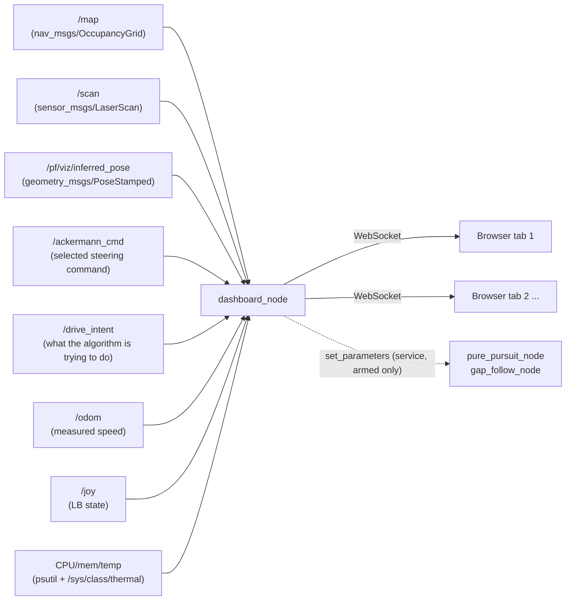

# Live web dashboard: see what the car sees

> **Who this is for:** anyone who wants to see what the car sees, or tune a driving node's parameters while it runs.
> **Read first:** [operations.md](operations.md) so you can bring the car up. Safe to run alongside anything — it publishes to no topic.
> **You'll be able to:** watch map, LiDAR and pose live in a browser, and adjust driving parameters without a rebuild.

Open a browser on a laptop or phone, point it at the car, and watch what the car is seeing — live, as it drives.

No RViz. No ROS install on the viewing device. No login. Just a URL.

---

## Highlights

- **Streams map updates as changes, not frames.** A full [occupancy grid](glossary.md#occupancy-grid) — the map, stored as a big array of "free / wall / unknown" cells — is 819 kB/s on the wire; after the first send, updates run about **0.04 kB/s**. Total dashboard traffic dropped from **7.1 Mbit/s to 0.45 Mbit/s** — measured, not estimated.
- **Live parameter tuning with no rebuild.** Change a driving node's speeds, geometry or safety margins from a phone and the running node applies them on its next control tick. The old loop — stop, `Ctrl+C`, edit YAML, rebuild, relaunch, re-seed localization — becomes a slider.
- **Read-only by construction.** The [node](glossary.md#node) publishes to **no ROS [topic](glossary.md#topic) at all**. It cannot steer, accelerate or brake, so it's safe to leave running during a race. The one write path (tuning) is a bounded service call, not a publisher.
- **Shows the algorithm's *intent*, not just its output.** A curved arrow ahead of the car draws where the controller plans to go, how fast, and which constraint is currently holding it back — so you can catch a wrong plan while it's still only a plan.
- **Works at every stage.** Nothing else running? You still get live [LiDAR](glossary.md#lidar). [SLAM](glossary.md#slam) up? The map builds in front of you. Once [localization](glossary.md#localization) has a fix, everything locks to world coordinates.
- **Runs on a phone.** One plain JS file, no build step, no framework. A 2048×2048 keyframe is 4.2 million cells, drawn through a palette lookup so a phone can keep up.
- **Costs the car almost nothing.** Packing a map message went from 178 ms to 2.2 ms. With no browser connected, none of the work happens at all.
- **Reachable by name, from off-network.** The server listens on both kinds of internet address at once, so `http://racerbotcar-2:8080/` opens the car over [Tailscale](#viewing-over-tailscale-by-name) from anywhere — you don't have to look up a number first.

**Honest limits:** no authentication of any kind — anyone who can reach the port can watch, and if tuning is armed, change how the car drives. One car per dashboard. Live SLAM without a pose republisher shows the map but keeps the car centred rather than locked to it. All three are covered below.

### Why it exists

Debugging a robot without this means reading terminal spam and guessing where the car thought it was. Whether localization had converged, whether the LiDAR saw the obstacle, why the car braked at that corner — all of it was invisible until after the run, if ever.

The dashboard makes the car's own view of the world something you can watch in real time, from any device on the network, while it drives. It's the difference between debugging from evidence and debugging from memory.

---

## What it shows

`web_dashboard` streams, all live:

- the SLAM/localization **map** as it builds — SLAM being the process that draws the map while driving through it
- **LiDAR** returns, coloured by how close they are
- the car's **pose** (position and heading)
- measured **speed** from `/odom` and the selected **steering** from `/ackermann_cmd`
- **LB state** and an LB-gated stopwatch
- coarse **system health** — CPU, memory, temperature, WiFi, uptime
- the **camera feed** in a corner inset, if [`usb_cam_stream`](../src/usb_cam_stream/README.md) is running
- **drive intent** — what the driving algorithm is trying to do, and why

A [live tuning panel](#live-parameter-tuning) can also adjust a running driving node's speeds and safety margins from the same page.

This is the reference example of "support/tooling code" in [adding-your-own-code.md](adding-your-own-code.md) — read that first if you're building something similar.

> **This doc covers the workflow, what you'll see, and how the pieces fit together.** For a line-by-line code walkthrough — the wire protocol, every parameter, the thread-bridging pattern — see [src/web_dashboard/README.md](../src/web_dashboard/README.md).

---

## Start it

**Terminal 1, from `~/racerbot-ws`:**

```bash
source /opt/ros/jazzy/setup.bash && source ~/racerbot-ws/install/setup.bash
ros2 launch web_dashboard web_dashboard_launch.py
```

**Working when:** the log reports the server listening on port 8080. Then open `http://<car-ip>:8080/` in any browser on the same network.

Find `<car-ip>` with `hostname -I` on the car, or use its Tailscale address — see [Finding the car's address](#finding-the-cars-address-and-viewing-through-a-forwarded-port).

**No other node needs to be running first.** Worst case, with nothing else up, the page just shows "no [scan](glossary.md#scan) yet" — a scan being one sweep of LiDAR distance readings.

### Why it's safe to start at any time

This node **publishes to no ROS topic at all** — not `/drive`, not `/ackermann_cmd`, not anything. It cannot steer, accelerate, or brake the car.

So the workspace's [mandatory LB-deadman policy](architecture.md#workspace-policy-the-lb-deadman-button-is-mandatory-for-every-node-that-can-move-the-car) does not apply to it. That policy is scoped to nodes that can *move the car* (see [writing-your-own-node.md](writing-your-own-node.md#the-interface-contract)), and there's no driving output here for a deadman check to gate. Reading LB only gates the stopwatch.

Leave it running at all times, alongside anything else in this workspace: `bringup_launch.py`, SLAM, localization, `gap_follow`, `pure_pursuit`, all of it.

> **It is not purely a *viewer* any more, though.** [Live parameter tuning](#live-parameter-tuning) — on by default — lets it call the standard `/<node>/set_parameters` service on this workspace's driving nodes.
>
> That is a real path to the car. Read [that section](#live-parameter-tuning) and the [security note](#security-note) before using it at a shared venue. Set `enable_tuning: false` for the strictly read-only dashboard.

---

## What you'll actually see

The dashboard degrades gracefully depending on what's running, so it's useful at every stage of [operations.md](operations.md) — not just once everything is set up.

| Running | What the dashboard shows |
|---|---|
| Just [`/scan`](glossary.md#scan) (LIDAR driver only) | **Robot-centric mode**: the car fixed at the center of the screen, always facing "up", with the raw LIDAR points drawn around it exactly as the beams came in. No map, no localization needed — this is literally "what the car is seeing," live. |
| `/scan` + `slam_toolbox` mapping | The map builds and updates live in the background as you drive; the scan stays robot-centric (see [Limitations](#limitations) for why the overlay doesn't lock onto the map during live SLAM specifically). |
| `/scan` + a saved map + `particle_filter` localized (seeded with RViz's "2D Pose Estimate") | **Map-relative mode**: the map is the background, the car is drawn at its real localized position and heading, and the LIDAR points are drawn in true world coordinates — so you can directly see where the car is relative to the walls, other objects, and the rest of the track. |

### Reading the colours

The dashboard is styled as a **HUD** — a heads-up display, the kind of instrument panel you'd see in a cockpit. Near-black background, cyan hairlines and corner brackets, small uppercase labels, monospaced numbers.

That look carries one rule that's worth knowing before you read anything off the page:

**Colour means state, never decoration.**

- **Cyan** is *the system talking* — the car marker, the rectangle on the minimap showing what you're looking at, the scale bar. Cyan is never an opinion about how the car is doing.
- **Green, amber and red** are reserved for what the car has **decided**: go, caution, stop.

So anything red on this page means something. That's also why the car icon is cyan rather than red: a permanently red car competed with "stop" meaning stop, and after a while the eye stops believing red.

### Getting just `/scan` without the rest of the hardware

If you only want LiDAR — no `joy_node`, [VESC](glossary.md#vesc) (the motor controller), or `ackermann_mux`, which otherwise only come bundled via `bringup_launch.py` — run the LiDAR driver directly with the same config:

**Terminal 2, from `~/racerbot-ws`:**

```bash
source /opt/ros/jazzy/setup.bash && source ~/racerbot-ws/install/setup.bash
ros2 run urg_node urg_node_driver --ros-args --params-file src/f1tenth_system/f1tenth_stack/config/sensors.yaml
```

**Working when:** the dashboard's scan feed dot turns green and points appear around the car.

The Hokuyo is Ethernet-connected (see [hardware-reference.md](hardware-reference.md#lidar--hokuyo-ust-10lx)). On a fresh boot, if the `hokuyo` NetworkManager profile hasn't auto-connected yet, bring it up first with `nmcli connection up hokuyo`, then confirm with `ping 192.168.0.10`.

---

## How it works


```mermaid
flowchart LR
    M["/map\n(nav_msgs/OccupancyGrid)"] --> N[dashboard_node]
    S["/scan\n(sensor_msgs/LaserScan)"] --> N
    P["/pf/viz/inferred_pose\n(geometry_msgs/PoseStamped)"] --> N
    D["/ackermann_cmd\n(selected steering command)"] --> N
    I["/drive_intent\n(what the algorithm is trying to do)"] --> N
    O["/odom\n(measured speed)"] --> N
    J["/joy\n(LB state)"] --> N
    T["CPU/mem/temp\n(psutil + /sys/class/thermal)"] --> N
    N -- WebSocket --> B1[Browser tab 1]
    N -- WebSocket --> B2[Browser tab 2 ...]
    N -. "set_parameters (service, armed only)" .-> D1["pure_pursuit_node\ngap_follow_node"]
```

One ROS2 node (`dashboard_node.py`) does two jobs in one process:

1. **Subscribes** to map, scan, pose, selected command, odometry, and joy topics, exactly like any other node. It separately samples system stats (CPU, memory, temperature, uptime) on a timer rather than from a topic.
2. **Runs a small web server** that serves the dashboard's HTML/JS/CSS as static files, and pushes every update to any connected browser tab over a WebSocket.

The server is [Tornado](https://www.tornadoweb.org/) — a mature, single-dependency Python library that already ships on this machine.

These subscriptions only feed displays and the dashboard-local stopwatch. Enabling or resetting the stopwatch changes no car state.

<details>
<summary><b>Two concurrency models sharing one process</b> — the rclpy-to-Tornado thread bridge. A genuinely reusable pattern if you ever need to connect rclpy to an asyncio library.</summary>

rclpy's executor (which calls this node's subscription callbacks) and Tornado's IOLoop (which runs the web server) don't share a thread by default.

This node spins rclpy on a background thread and lets Tornado's IOLoop own the main thread. Every subscription callback hands its update to the IOLoop via `add_callback()` — Tornado's documented thread-safe hand-off — instead of ever touching a WebSocket connection directly from the ROS thread.

See the comments at the top of `dashboard_node.py` for the full reasoning.

</details>

<details>
<summary><b>The wire protocol</b> — how a 2000×2000 occupancy grid gets to a phone without melting the WiFi. Read if you're changing the protocol or debugging a corrupt message.</summary>

Sending a 2000×2000-cell occupancy grid as a JSON array of numbers would be enormous and slow to parse.

Instead, every update travels as two messages back to back:

1. **One JSON text message** — the metadata. "Here's what's coming and how to read it."
2. **One binary message** — the raw payload.

The binary payload is chosen to match a JavaScript `TypedArray` byte-for-byte, so the browser does zero manual parsing.

| Update | JSON header | Binary payload |
|---|---|---|
| Map (keyframe) | `seq`, width, height, resolution, origin, `encoding` | the whole grid, one signed byte per cell, exactly matching `OccupancyGrid.data` (-1 unknown, 0 free, 100 occupied) — deflated |
| Map (patch) | `seq`, `x`, `y`, `w`, `h`, `encoding` | only the rectangle of cells that changed since the previous map message |
| Scan | `encoding`, angle range/increment, LIDAR mounting offset | `Uint16Array` of millimetres (default) or `Float32Array` of metres — half the bytes for a difference below one screen pixel |
| Batch | `items`: a tick's worth of the compact updates below, in one frame |  *(none)* |
| Pose | `{x, y, yaw}` | *(none — small enough to just be JSON)* |
| Drive | selected-command `{speed, steering_angle}` | *(none)* |
| Speed | measured `{speed}` from odometry | *(none)* |
| Stopwatch | elapsed/enabled/running plus LB/freshness flags | *(none)* |
| Stats | `{cpu_percent, mem_percent, cpu_temp_c, uptime_s, wifi_dbm}` | *(none — `cpu_temp_c`/`wifi_dbm` are `null` if no readable thermal zone / wireless interface was found)* |
| Intent | what the driving node is *trying* to do: predicted path, speeds, the constraint currently binding, and the reason — see [drive-intent.md](drive-intent.md) | *(none)* |
| Tuning | the whole panel: per node, whether it's up, its advertised catalogue, and every current value | *(none)* |
| Tuning result / saved / armed | outcome of one change, of a save, and this connection's arm state | *(none)* |

All of this conversion lives in `web_dashboard/protocol.py`, deliberately kept free of any ROS, Tornado, or network imports.

That's what makes it directly unit-testable (`test/test_protocol.py`) without a running robot, browser, or web server.

</details>

<details>
<summary><b>What this costs the car</b> — the full before/after measurements on WiFi and CPU, and where the CPU floor actually comes from. Worth reading before you believe the "safe to leave running" claim.</summary>

The dashboard is documented above as safe to leave running at all times, including during a race. That is only an honest claim if it is genuinely cheap, so here is what it actually costs, measured on this car's Jetson.

**On the WiFi link**, per connected tab, while driving with SLAM mapping:

| | Before | After |
|---|---|---|
| `/map` | 819 kB/s (the whole 2048×2048 grid, re-sent every 5s) | ~0.04 kB/s (a patch), or ~24 kB compressed on a keyframe |
| scan | 44 kB/s (float32) | 22 kB/s (uint16 millimetres) |
| intent | 31 kB/s | 24 kB/s (the commanded path is dropped while it matches the desired one) |
| pose + command + speed + stopwatch | 14 kB/s | folded into one 20Hz frame |
| WebSocket frames | ~155/s | ~40/s |
| **total** | **~914 kB/s (7.1 Mbit/s)** | **~57 kB/s (0.45 Mbit/s)** |

Measured live against the simulator over a 60s mapping run: **61 kB/s, 0.48 Mbit/s, zero dropped frames**.

Re-run it yourself with `tools/web_dashboard/bench_protocol.py`, or against a live car with `tools/racerbot_sim/capture_dashboard.py --report`.

**Why this mattered so much while *driving* specifically** is circular. Driving is when `slam_toolbox` is mapping, and `slam_toolbox` republishes its entire grid every `map_update_interval` whether or not anything in it changed.

The region that actually changed between two of those messages compresses to about 200 bytes.

**On the Jetson's CPU**, the honest picture is more mixed.

Packing the map went from 178 ms to 2.2 ms per message, and the fan-out from ~3.3% of a core to ~0.8%. None of it happens at all when no browser is connected.

But `dashboard_node`'s *total* CPU is dominated by rclpy's own executor and message deserialization, which this work does not touch. With no browser attached it sits around 35% of a core — right alongside `auto_map_race` (34%), `pure_pursuit` (32%) and `gap_follow` (25%) in the same run.

Every Python node in this workspace pays that floor. Attaching a browser is now lost in the noise of it.

If you need the node itself cheaper than that, the lever is `enable_tuning: false`, which removes two service clients and the 0.5Hz graph query — not any of the above.

</details>

<details>
<summary><b>The browser side</b> — rendering, the map palette, coordinate transforms, and the car icon. Read if you're changing the UI or wondering why the map is a different colour scheme from RViz.</summary>

`web/dashboard.js` is one plain file — no build step, no framework. It connects to `ws://<host>/ws`, keeps the latest map/scan/pose/command/speed/stopwatch/stats in a small state object, and redraws an HTML5 `<canvas>`.

Drag to pan (works both before and after localization), scroll to zoom toward the cursor, "reset view" to re-fit.

**The browser owns the map.** The occupancy grid is rendered into an off-screen canvas, and thereafter the car sends only patches, which are blitted into that same canvas.

So the expensive full redraw happens on connect and on the occasional keyframe, rather than every few seconds.

Each cell is coloured through a 256-entry palette indexed by its raw byte: one lookup and one 32-bit store, rather than a branch and four byte writes. That matters when a 2048×2048 keyframe is 4.2 million cells and the thing doing the work is a phone.

Patches carry a sequence number and are applied only when they are the exact successor of the last frame. On any gap the browser waits for a keyframe, rather than painting a map that is subtly wrong.

Compressed payloads are inflated with `DecompressionStream`. If a browser is old enough not to have it, the console says so, and `map_compression: false` is the fix.

**Repaints are coalesced** through `requestAnimationFrame`: many state updates arriving together (a batch frame carries several) produce one repaint, not one each. A hidden tab draws nothing at all while still tracking everything the car sends — worth knowing if you leave the dashboard open on a second monitor or a phone in your pocket.

**The map palette is deliberately not RViz's.** The ROS/RViz convention of white free space on mid-gray unknown looked like a lit-up slab pasted over the page, and washed out the scan drawn on top of it.

The polarity is inverted instead:

- **unknown** fades almost completely into the page background
- **free space** is a dark slate "track surface"
- **occupied cells** are the bright end — a desaturated blue-gray

That keeps walls the most legible thing in the map, without competing with the saturated red→green LIDAR points or the cyan car icon. Cells between free and occupied interpolate between the two.

Since unknown area fades out, a one-pixel cyan hairline — the same one every panel border uses — marks the grid's extent. All three colors are constants at the top of `applyMap()`'s section in `dashboard.js` if the theme ever changes.

**Two coordinate transforms, two pan offsets.** Robot-centric mode (no pose yet) and map-relative mode (once localized) use `bodyToCanvas` vs `worldToCanvas`.

So panning and zooming track their own offset in each: `view.bodyPanX/bodyPanY` for the former, `view.centerX/centerY` for the latter.

They deliberately don't share one, since a drag that happened before localization has no meaningful world-frame equivalent to carry over.

**The car icon.** A small top-down car silhouette rather than a bare arrow: rounded cyan body with a faint glow, four wheels, and a dark "windshield" stripe near the nose.

The stripe is the one cue that makes heading unambiguous at a glance. A plain rectangle looks the same front-to-back.

A translucent red wedge marks the LIDAR's actual blind spot: the arc it physically never scans. The Hokuyo's ~270° field of view leaves a real ~90° gap behind its mount.

That wedge is computed from the scan's own `angle_min` / `angle_increment` / count, **not** guessed from which beams read "no return" this frame. Open space with nothing in range would look identical to a blind spot that way, and shouldn't be flagged as one.

Valid returns use a red→yellow→green proximity scale (0.3 m near to 5 m far). A scale bar in the bottom-left corner shows the current zoom level in meters or cm.

**The faint grid behind everything** is not texture. It does two jobs:

- Its spacing is one of the same round metre steps the scale bar reports, so a distance on the map can be counted off in squares.
- It's anchored to the world origin rather than to the screen, so it slides *under* the car as the car moves.

That second job is the real reason it's there. Drag across an unmapped region without it and nothing appears to move, because there's nothing in view to move.

</details>

<details>
<summary><b>Layout: what every panel does</b> — sidebar, minimap, camera inset, and the resizing behaviour. Read when you want to know what a control does or why the sidebar behaves as it does.</summary>

**Nothing on this page resizes itself while you're reading it.** Numbers use a monospaced font with tabular figures, so a changing digit never changes a column's width.

Every region that fills in later — the decision log, the reason text, the connection banner — has its space reserved up front and scrolls inside it.

That's a fix rather than a preference. Measured with WebDriver over 20 seconds of streaming telemetry, the decision log used to gain 16.5 px per decision.

Every one of those entries shoved the stopwatch, the `system` section and the pinned footer further down the sidebar — every time the car changed its mind.

If you edit `web/style.css`, keep both that rule and the colour rule above. There are comments at the top of that file explaining each, and `test/test_web_assets.py` pins the structural parts so a redesign can't quietly undo them.

**Left sidebar**, in order:

- connection status
- `feeds`
- `intent`
- `vehicle` — measured speed, selected steering, LB state
- an LB-gated stopwatch, with enable and reset
- `system` health
- `live tuning` — which driving nodes are tunable, plus the button that opens the panel

Feed dots are gray = never received, green = fresh, red = stale.

**Sections collapse.** Click a header to fold it away. A collapsed section still shows its headline value in its own header, so hiding `vehicle` does not cost you the speed. Which ones you keep open is remembered in your browser, per device.

The sidebar is bounded to the window and scrolls, and each row shows a short value with the full detail in its tooltip. Both are fixes rather than preferences.

> Previously the sidebar grew to whatever height it wanted while the page itself could not scroll. On a laptop or a phone, the bottom of it — the decision log, the tuning button, "reset view" — was rendered below the bottom of the screen with no way to reach it.
>
> The decision log and the reason text scroll on their own, which they also could not do before. The whole sidebar ignored pointer events so that you could drag the map "through" it — which meant the scroll wheel went past the log to the canvas and zoomed the map instead.
>
> Panning still works everywhere outside the sidebar.

**Top-right inset** — a minimap. It always shows the *whole* map at a fixed auto-fit scale, independent of the main canvas's own pan and zoom.

A rectangle in the UI's accent cyan shows what the main view currently frames, plus a small marker for the car.

So zooming into one corner of the track on the main canvas doesn't lose the big picture. Shows a placeholder until a map has arrived.

**Bottom-right inset** — the live camera feed, if [`usb_cam_stream`](../src/usb_cam_stream/README.md) is running.

This is a completely separate node on its own port (`9090`) — the browser just points an `` at `http://<car-ip>:9090/stream` directly. An MJPEG stream is a plain, never-ending HTTP response: no WebSocket, no JSON frame.

If that node isn't running, the inset shows a "camera offline" placeholder and retries the connection every 3 seconds — no need to reload the dashboard page once the camera node starts.

Either variant of that node fills this panel: `usb_cam_stream_launch.py` (a UVC webcam) or `realsense_stream_launch.py` (the RealSense D435i's color feed, via its ROS topic — see [realsense-camera.md](realsense-camera.md)). They share port 9090, so run one at a time.

Click the inset to open a new full-window recording tab with current time, speed, steering, LB, stopwatch, CPU, and WiFi overlays; use the browser's tab or screen recording on that view.

**Resizing the camera inset:** hover it and a grip appears in its top-left corner, where the "camera" label normally sits. Drag it to make the feed as large or small as you want; double-click to go back to the default size.

The panel is pinned to the bottom-right corner, so that's the only corner that can move.

Dragging *scales* the panel along the stream's own aspect ratio rather than reshaping it freely. The inset is therefore always exactly the shape of the frame: the whole image visible at every size, never cropped and never letterboxed.

It won't grow over the sidebar or up into the minimap, and the size is remembered in the browser's `localStorage` (per browser, not per session — the car doesn't know about it). Dragging the grip never opens the recording tab, even though the rest of the panel is a link.

</details>

<details>
<summary><b>The recording view (<code>camera.html</code>)</b> — the full-window camera page and its fullscreen behaviour. Read if you're capturing footage.</summary>

Clicking the camera inset opens this in a new tab: the camera feed as the whole page, with a compact telemetry overlay (clock, speed, steering, LB, stopwatch, CPU, WiFi) in the top-left. It's meant to be captured with the browser's or OS's own screen recorder.

By default the frame is **letterboxed** — the entire image is visible, with dark bars wherever the window's shape and the camera's disagree. That's what you want while framing a shot.

**Fullscreen fills the screen with no bars at all:** click `fullscreen` in the top-right, press `F`, or double-click the video. The frame is scaled up until it covers the screen and whatever overflows the edges is cropped.

It's never stretched, since a distorted frame would misrepresent how far away things are. `F` again or `Esc` leaves fullscreen and returns to the whole-frame view.

The fullscreen button and the mouse cursor both fade out after ~2.5 s of no input, so neither ends up baked into a recording. Any mouse movement or keypress brings them back.

</details>

---

## "The map looks glitchy"

Three different things produce that complaint and they have different fixes, so **measure before changing anything.**

**Terminal 1, from `~/racerbot-ws`:**

```bash
# Connect for a whole run, validate every frame, write a picture per phase
tools/racerbot_sim/capture_dashboard.py --seconds 280 --interval 40 \
    --output /tmp/run.png --report /tmp/run.json
```

**Working when:** it exits zero. A non-zero exit means at least one binary frame failed its length check. The report separates the causes below.

### 1. The view moving, not the map

The dashboard frames the map automatically until you pan or zoom.

It used to re-derive centre and zoom from *every* `/map` message — and `slam_toolbox` resizes and re-origins its grid constantly as the map grows, shrinking as often as growing.

> Measured over 130 s of mapping: 27 map messages, **18 view disturbances, the picture sliding up to 3.6 m and rescaling by up to 36%**, while the map itself was perfectly good.

It now frames the map once and re-fits only when the map no longer fits on screen. The same run gives **2**, both of them the map genuinely growing.

**If you want it to stop moving entirely, pan or zoom once.** That latches `userAdjusted` and auto-fit never runs again.

### 2. The map really is bad

Thick, doubled or fuzzy walls are `slam_toolbox` smearing scans over a drifting odometry estimate. The dashboard is telling the truth.

Reproduced deliberately with an 18% odometry scale error: the walls come out visibly thickened and the inner island's edge becomes a dotted band.

**That is a calibration problem** ([odom-calibration.md](odom-calibration.md)), not a display one. The supervisor's `SLAM corrections absorbed=` counter in the mapping log is the matching number — a handful per lap is normal, dozens is not.

### 3. Two stacks running at once

Worth ruling out first, because it looks worse than either of the above.

A leftover launch publishing a second `/map` and a second pose makes the dashboard alternate between two unrelated worlds, frame to frame.

```bash
ros2 node list | grep slam
```

**Working when:** exactly one result.

<details>
<summary><b>Frame corruption, and why it is now impossible to miss</b> — the guard against a header/payload desync. Read if you're changing the protocol.</summary>

Every map and scan travels as a JSON header immediately followed by one binary frame, and the browser holds a single "what does the next binary mean" slot.

A header that never gets its binary leaves that slot pointing at the wrong thing, and the *next* payload is decoded as the previous type.

A 1081-beam scan read as occupancy cells is 4324 bytes against an 80000-cell header. Every read past the end is undefined, every colour computes to NaN, and **the map paints as garbage rather than failing**.

That's the dangerous part: a silent wrong answer rather than an error.

So both headers now declare `bytes`. The browser checks it and drops the frame rather than painting it, and the count appears in the mode banner.

The server also drops any client whose header/payload pair it could not complete, so that client reconnects and resynchronises.

Across the validation runs above — roughly 7,500 binary frames — **zero** frames failed that check. So this is a guard against a failure that has not been observed, rather than a fix for one that has. It costs one integer per header.

</details>

---

## Running it

### Dashboard by itself — map, scan, pose, no camera

**Terminal 1, from `~/racerbot-ws`:**

```bash
source /opt/ros/jazzy/setup.bash && source ~/racerbot-ws/install/setup.bash
ros2 launch web_dashboard web_dashboard_launch.py
```

**Working when:** `http://<car-ip>:8080/` loads. See [Finding the car's address](#finding-the-cars-address-and-viewing-through-a-forwarded-port) if you're not sure what to put there.

That's the entire procedure for the dashboard alone.

This node reads command, odom and joy only for display and its local stopwatch, and publishes to no topic. So none of the joystick-override or wheels-off-ground precautions in [operations.md](operations.md) apply to *starting* it — it's safe to start and stop at any time, on top of anything else.

(Changing a driving node's parameters from its tuning panel is a different matter — see [Live parameter tuning](#live-parameter-tuning).)

To point it at different topics — testing against a bag file, say — or a different port, edit `src/web_dashboard/config/web_dashboard.yaml`. See the [parameter reference](#parameter-reference).

### With the camera panel filled in too

Two terminals, each sourced the same way as above.

Order doesn't matter. All components are support/tooling nodes (see [adding-your-own-code.md](adding-your-own-code.md)) and none of them touch `/drive`.

So there's no bringup sequencing and no LB-deadman precaution here, unlike the driving-code procedures in [operations.md](operations.md).

```bash
# Terminal 1 — RealSense driver + color-topic MJPEG stream on port 9090
ros2 launch racerbot_launch realsense_camera_launch.py

# Terminal 2 — dashboard and recording view on port 8080
ros2 launch web_dashboard web_dashboard_launch.py
```

**Working when:** `http://<car-ip>:8080/` loads and the bottom-right camera inset fills in within a few seconds.

If the camera panel still says "camera offline" after a few seconds, it's almost always [the forwarded-port issue](#finding-the-cars-address-and-viewing-through-a-forwarded-port), not a launch-order problem. The panel retries every 3 seconds on its own, so a panel that *never* fills in — rather than one that briefly says offline before connecting — is the tell.

### One-shot bundle for testing: LiDAR + camera + dashboard, no driving

`racerbot_launch/launch/dashboard_test_launch.py` bundles the three nodes above *and* a standalone `urg_node`, so the `/scan` panel fills in too. That's everything the dashboard can show, minus the VESC/joy/`ackermann_mux` driving stack from `bringup_launch.py`.

Same support/tooling category, so no LB-deadman check and no bringup ordering to worry about.

**Terminal 1, from `~/racerbot-ws`:**

```bash
ros2 launch racerbot_launch dashboard_test_launch.py
```

**Working when:** `http://<car-ip>:8080/` shows live scan points *and* a camera feed.

This is for bench-testing the dashboard and sensors only. For actual driving, use `bringup_launch.py` plus a control layer as usual, and `web_dashboard_launch.py` on its own if you also want the dashboard alongside them (see [operations.md](operations.md)).

### Finding the car's address, and viewing through a forwarded port

**Use the car's real network address, not `localhost`, whenever you can.**

**On the car:**

```bash
hostname -I
```

**Working when:** it lists at least one address. The LAN one (e.g. `192.168.x.x`, see [hardware-reference.md#network](hardware-reference.md#network)) works from any device on the same network. The Tailscale one (`100.x.x.x`, same section) works from anywhere Tailscale is set up, including off-network.

Either one, browsed directly, is the normal and intended way to use this dashboard — from a laptop or phone, no code editor involved.

**If you're viewing through an editor's port-forwarding feature instead**, map, scan, pose and system stats all still work fine.

(That is, VS Code's Ports panel showing `localhost:8080` in your address bar, because it tunneled port 8080 from the car.)

They travel over the one WebSocket connection to that same forwarded origin.

> **The camera panel is the exception.** `dashboard.js` makes your *browser* open a second, independent HTTP connection straight to `<the address in your address bar>:9090`.
>
> See `CAMERA_PORT` in `dashboard.js`. It substitutes whatever hostname is currently in the URL.
>
> If that hostname is `localhost` because of a tunnel, your browser tries `localhost:9090` on *your own laptop* — which is nothing, since only port 8080 was forwarded. The panel shows "camera offline" even though everything on the car is running correctly.

Two ways to fix it:

1. **Browse the car's real address instead** (`hostname -I` above). The camera panel then resolves `9090` against that same real address and just works. Simplest fix, and matches how the dashboard is meant to be used.
2. **Or forward port `9090` too**, in addition to `8080`, using the same mechanism (VS Code's Ports panel → "Forward a Port" → `9090`). The panel's own 3-second retry picks it up automatically — no page reload needed.

This isn't specific to the camera panel or this dashboard. Any tool that has a browser make a *second* connection to a *different* port than the one you loaded the page from will hit the same issue under port-forwarding. The camera panel is just the one place in this workspace that currently does that.

### Viewing over Tailscale, by name

Tailscale is the private network that lets you reach the car from anywhere, not just from the same WiFi. It gives the car **two** addresses, not one:

- an **IPv4** address, the familiar four-numbers kind: `100.107.122.58`
- an **IPv6** address, the newer and much longer kind: `fd7a:115c:a1e0::4133:7a3b`

Both point at the same car. Tailscale also publishes a short hostname for it — that feature is called *MagicDNS* — so you can type `http://racerbotcar-2:8080/` instead of memorising either number.

Here's the part that used to bite. When you browse by *hostname*, your browser is handed both addresses and picks one — and browsers generally try the IPv6 one first.

The dashboard used to listen on IPv4 only. So that first attempt was refused, and the page could fail to load while the car was running perfectly.

Browsing the `100.x.x.x` address directly still worked, which made the whole thing look like a Tailscale problem rather than a dashboard one.

**It now listens on both**, so the hostname, the IPv4 address and the IPv6 address all work, with nothing to configure. `host: 0.0.0.0` in the config is understood as "every interface, both kinds of address".

**Terminal 1, on the car**, to confirm it's listening on both:

```bash
ss -tlnp | grep 8080
```

**Working when:** you get *two* lines rather than one — an IPv4 one (`0.0.0.0:8080`) and an IPv6 one (`[::]:8080` or `*:8080`). Only `0.0.0.0:8080` means you're running an older build; rebuild `web_dashboard` and relaunch.

The node says so at startup too. Look for `Serving on port 8080, every interface, IPv4 + IPv6` in the launch output.

> **If it still won't connect from another machine,** the remaining suspects are on the Tailscale side rather than in this node. Check that both machines are online with `tailscale status`, and that "shields up" — a Tailscale setting that blocks all incoming connections — is off. `tailscale debug prefs` prints `"ShieldsUp": false` when it's fine.

<details>
<summary><b>Why <code>0.0.0.0</code> wasn't already enough</b> — the bind-address trap, and why it got its own module. Skip unless you're changing how the server binds.</summary>

The trap is that `0.0.0.0` does not mean "every interface". It means every *IPv4* interface, and there is no IPv4 wildcard that also covers IPv6. Binding with **no address at all** is what gets both families.

So `netbind.wants_all_interfaces()` recognises the wildcard spellings (`0.0.0.0`, `::`, `*`, empty) and the node then binds with no address. Naming a real address, like `127.0.0.1`, still restricts the dashboard to exactly that address — that behaviour is unchanged, and is what the [security note](#security-note) below relies on.

That decision lives in its own `rclpy`-free module, `src/web_dashboard/web_dashboard/netbind.py`, specifically so it can be unit-tested directly.

`test/test_netbind.py` binds real sockets and asserts that the old way is IPv4-only while the new way answers on both.

It has to go that far because this class of bug is completely invisible to a test that only checks a return value.

</details>

---

## Drive intent: the arrow and the decision panel

Once a driving node is running, the dashboard draws a curved arrow ahead of the car showing where the algorithm **intends** to go, and a sidebar panel explaining **why** it is deciding what it is deciding.

Full specification, safety contract, and the porting guide for teammates' codebases: [drive-intent.md](drive-intent.md).

> **This is not measured speed or heading redrawn** — those are already on screen under *vehicle*. It is the plan the controller is acting on, which is what lets you catch a wrong plan while it is still only a plan.

Reading the arrow:

| What you see | What it means |
|---|---|
| **Length** | Distance the plan covers over `intent_horizon_sec` (1.5s). A stopped car draws no arrow; a fast one draws a long one. |
| **Width** | Planned speed, sampled along the arrow — so it tapers into a corner and flares coming out. |
| **Curve** | `pure_pursuit` re-runs its steering law along the racing line, so the arrow bends through the corner ahead. `gap_follow` chooses a heading rather than a path, so its arrow is a single arc. |
| **Colour** | Green = ordinary driving, amber = something unusual (corner fallback, overtake, reactive override), red = stopped. |
| **Dashed line** | What the command actually on the wire will produce. The gap between it and the solid ribbon *is* the slew-rate/acceleration shaping. |
| **Blue wedge** | The gap `gap_follow` selected out of the scan, drawn from the LIDAR's own origin. |
| **Dot + label** | The point being steered at — `gap target` or `steering target`. |
| **Dashed stub + ring** | A stop. The stub shows where the steering rack is being *held*, which `gap_follow` does deliberately rather than centring it. |

The panel below shows the current state and the reason sentence — the same text the terminal logs.

It also lists every speed ceiling that competed, with the binding one in bold, and a rolling log of the last 20 state transitions with how long each held.

**The binding limit is the thing to look at first.** It answers "what is actually holding the car back right now", which a single commanded-speed number cannot.

Untick *arrow* in the panel header to hide the overlay without touching the car — useful while lining up a waypoint recording.

If nothing is publishing, the panel says so and the map is unchanged. This is another purely additive subscription; the dashboard still publishes to no topic.

---

## Live parameter tuning

Open the **live tuning** panel from the sidebar to change a running driving node's speeds, geometry, and safety margins without editing YAML and relaunching.

Values apply on the node's very next control tick, so you can lower `max_speed`, feel the difference on the next lap, and put it back. The loop that used to be "stop the car, `Ctrl+C`, edit a file, rebuild, relaunch, re-seed localization" becomes a slider.

**This is the only part of the dashboard that reaches the car**, so it's worth understanding exactly what it can and cannot do.

### What it can't do

- **It cannot move the car.** There is still no publisher to `/drive` here. The car moves because an autonomy node decided to, and only while the driver holds LB. Tuning changes *how* a moving car behaves; it can never start one.
- **It cannot relax the deadman.** `enable_deadman` is not tunable, from here or from `ros2 param set`, on any node — the driving nodes refuse it at runtime. The [workspace LB policy](architecture.md#workspace-policy-the-lb-deadman-button-is-mandatory-for-every-node-that-can-move-the-car) is a team decision, not a knob.
- **It cannot switch off `pure_pursuit`'s reactive safety net.** Its *thresholds* are tunable — a margin that's wrong for the track is a real thing to discover mid-session. `enable_lidar_safety` itself is not.
- **It cannot exceed a node's own limits.** Every tunable carries a hard min/max enforced inside the node that owns it, on every update. The dashboard's sliders stop at the same bounds, but only so the UI doesn't offer a value that will bounce. **The authority is in the node** — which is why a hand-rolled `ros2 param set` hits the same wall.
- **It cannot reach a teammate's code.** Only nodes named in `tuning_nodes` are ever probed, and they must additionally advertise a `live_tunable_spec` parameter to appear at all.

### Arming

Every control is inert until you flip **arm changes** at the top of the panel, and it starts disarmed on **every page load**. A reload, a dropped WiFi link, or a phone going to sleep all disarm it.

That's enforced on the server, per connection — not just greyed out in the browser — so a stale tab or a hand-rolled WebSocket client is refused the same way.

### Safety margins are marked

Parameters that move a collision margin or an emergency stop are grouped under a **Safety margins** heading in amber, with an amber accent on each control.

They're deliberately included: those are exactly the numbers you'd want to correct after watching the car stop too early on a tight section. But **they should never be dragged with the same casualness as a lap-time knob.**

### Live-only, until you save

Changes live in the running node's memory. **Restart the node and it's back to the config file.**

That's the useful property: a tune that turns out to be wrong is one `Ctrl+C` away from gone, and there's always a known baseline. Each control shows a **↺** once it differs from the value the node started with, which puts that single parameter back.

When a tune is worth keeping, **save tune to config files** writes it into the [package](glossary.md#package)'s YAML: `src/pure_pursuit/config/pure_pursuit.yaml` and `src/gap_follow/config/gap_follow.yaml`.

Those resolve through the `--symlink-install` chain to the real, git-tracked sources.

Only values that actually differ from the file are written, and every comment, blank line, and key order is preserved, so the result is a small diff you can read:

```bash
git diff src/gap_follow/config/gap_follow.yaml
```

**Working when:** the diff shows only the values you changed, with comments and ordering intact.

> **Review it before committing.** A saved tune is a change to the car's defaults for everyone. Set `tuning_allow_save: false` to allow live tuning but forbid writing to disk, which is a reasonable race-day setting.

### What's tunable

Each node advertises its own catalogue, so the panel is always in sync with the code rather than a hardcoded list that rots.

To read it from a terminal:

```bash
ros2 param get /gap_follow_node live_tunable_spec
```

**Working when:** it prints a JSON catalogue rather than "Parameter not set".

| Node | Groups |
|---|---|
| `pure_pursuit_node` | Speed (`max_speed`, `min_speed`, accel/braking, `max_lateral_accel`), Line following (lookahead trio, `max_steering_rate`), Avoidance, Overtaking, and Safety margins (`emergency_stop_distance`, `emergency_stop_clearance`, `safety_fov_deg`, `max_cross_track_error`) |
| `gap_follow_node` | Speed, Gap selection (`min_gap_distance`, `disparity_threshold`, `steering_gain`, …), and Safety margins (`max_braking_decel`, `safety_margin`, the forward reserve, TTC) |

The catalogues themselves — names, bounds, and the prose shown in the UI — live in `src/pure_pursuit/pure_pursuit/live_tuning.py` and `src/gap_follow/gap_follow/live_tuning.py`.

Adding a parameter is a change there, deliberately: it means picking a hard range and writing down what the knob does, in code that gets reviewed.

<details>
<summary><b>Why a node has to opt in</b> — the silent-failure this prevents, and the error messages you'll get. Read before adding a tunable, or if <code>ros2 param set</code> just refused you.</summary>

Both driving nodes read their parameters once at startup and cache them on instance attributes, because re-reading a parameter at 40Hz in the control loop would be pointless overhead.

That means a plain `ros2 param set` on a parameter the node doesn't explicitly handle **succeeds and changes nothing**. The parameter server stores the new value, the control loop keeps using the cached one, and a dashboard reading the value back would cheerfully display `max_speed: 2.0` for a car still driving 4.0.

So the nodes now **refuse** any runtime parameter change they don't know how to apply, instead of accepting it silently:

```
$ ros2 param set /gap_follow_node car_width 0.9
Setting parameter failed: 'car_width' cannot be changed while the node is
running. The control loop caches its parameters at startup, so accepting
this would change the reported value without changing how the car drives.
Restart the node with a new config to change it.
```

That's a deliberate tightening, and it applies to `ros2 param set` as much as to the dashboard.

Cross-parameter invariants are enforced the same way, and a rejected batch changes nothing at all — no half-applied speed limits:

```
$ ros2 param set /gap_follow_node min_speed 3.0
Setting parameter failed: min_speed (3) cannot exceed max_speed (1.5)
```

`pure_pursuit`'s existing runtime `waypoints_file` update — how `auto_map_race_node` hands over a freshly generated racing line — is unaffected.

</details>

### Testing a tune before trusting it

Same order as any other change to driving behavior ([writing-your-own-node.md](writing-your-own-node.md#testing-before-its-on-wheels)): wheels off the ground first, then floor at low speed, then open space.

> **A slider makes a change *fast*, not *safe*.** Raising `max_speed` mid-session deserves the same care as editing it in YAML would.

---

## Parameter reference

<details>
<summary><b>Every parameter in <code>web_dashboard.yaml</code></b> — 24 settings with defaults and meanings. A lookup table; read it when you need to change one.</summary>

All in `src/web_dashboard/config/web_dashboard.yaml`. A few entries mention [TF](glossary.md#tf--transform--frame), which is ROS2's record of where things sit relative to each other.

| Parameter | Default | Meaning |
|---|---|---|
| `map_topic` | `/map` | Subscribed with "transient local" durability to match `map_server`/`slam_toolbox`, so a dashboard started after the map was published still receives it |
| `scan_topic` | `/scan` | Subscribed with best-effort sensor QoS |
| `pose_topics` | `[/pf/viz/inferred_pose, /slam_pose]` | Every map-frame pose source this car can run, subscribed at once: `particle_filter`'s localized pose, and the pose `auto_map_race_node` republishes from SLAM's `map`→`base_link` TF. One dashboard process therefore works across all stacks without a relaunch; last message wins |
| `drive_topic` | `/ackermann_cmd` | Selected command after `ackermann_mux`; steering display and command-speed reference only |
| `odom_topic` | `/odom` | Measured longitudinal speed |
| `joy_topic` / `deadman_button` / `joy_timeout_sec` | `/joy` / `4` / `0.5` | Read-only LB state and freshness watchdog for the stopwatch |
| `stopwatch_update_rate_hz` | `4.0` | Shared stopwatch state broadcast rate. Low because the browser runs the clock between updates |
| `host` | `0.0.0.0` | Listen on every network interface, IPv4 **and** IPv6 — which is what makes the car reachable at its Tailscale hostname, see [viewing over Tailscale](#viewing-over-tailscale-by-name) and the [security note](#security-note). Set a real address (e.g. `127.0.0.1`) to restrict it to that one |
| `port` | `8080` | Web server port |
| `scan_broadcast_rate_hz` | `10.0` | `/scan` runs ~40Hz; no browser needs to redraw that often, and this keeps WiFi/CPU load down |
| `stats_interval_sec` | `1.0` | How often CPU%/mem%/temp/uptime are sampled and broadcast |
| `telemetry_rate_hz` | `20.0` | Pose/command/speed/intent/stopwatch/stats go out as ONE frame at this rate rather than one frame each — see [what this costs the car](#how-it-works) |
| `map_compression` | `true` | Deflate map keyframes and patches |
| `map_patching` | `true` | Send only the rectangle of the grid that changed. `false` goes back to whole grids, if a patch is ever suspected of painting the map wrong |
| `map_keyframe_sec` | `30.0` | Resend the whole grid at least this often, so a browser cannot stay wrong indefinitely |
| `scan_encoding` | `u16mm` | `u16mm` (uint16 millimetres — half the bytes, difference below one screen pixel) or `f32` |
| `scan_decimation` | `1` | Send only every Nth beam. `1` = every beam |
| `laser_offset_x` / `laser_offset_y` | `0.33` / `0.0` | Estimated LIDAR mounting offset from `base_link` (matches [hardware-reference.md](hardware-reference.md)), used to place scan points correctly relative to the car's pose |
| `enable_tuning` | `true` | Whether [live parameter tuning](#live-parameter-tuning) exists at all. `false` never creates the service clients, and the panel disappears — a strictly read-only dashboard |
| `tuning_nodes` | `[pure_pursuit_node, gap_follow_node]` | The only nodes this dashboard will probe or write to. An explicit list rather than bus discovery, which is what keeps it inside this workspace's own driving code |
| `tuning_config_files` | `[pure_pursuit/config/pure_pursuit.yaml, gap_follow/config/gap_follow.yaml]` | Parallel to `tuning_nodes`: `<package>/<path under its share dir>` for the file "save" writes back to. Blank = tunable live but never savable |
| `tuning_allow_save` | `true` | `false` allows live tuning but forbids writing it to disk |
| `tuning_refresh_sec` | `2.0` | How often node presence and current values are re-read |
| `tuning_request_rate_hz` | `20.0` | How quickly a released slider reaches the car |
| `tuning_service_timeout_sec` | `3.0` | When to give up on an unanswered parameter service call |

</details>

---

## Security note

**This dashboard has no authentication** and accepts WebSocket connections from any origin.

For the telemetry half that's a deliberate, reasonable trade-off for a tool that can only ever *watch*.

But it does mean anyone who can reach `<car-ip>:8080` on the network can see everything the dashboard shows. That is: map, scan and pose; command, odom and LB telemetry; the stopwatch; and coarse system stats (CPU, memory, temperature, WiFi, uptime).

And, if `usb_cam_stream` is running, the camera feed.

> **[Live parameter tuning](#live-parameter-tuning) does not rest on that reasoning, because it reaches the car.**
>
> It is bounded instead. It can't move the car or start it, can't disable the LB deadman, and can't exceed the bounds each driving node enforces on itself.
>
> It also requires an explicit per-connection arm that resets on every page load.
>
> What none of that protects against is someone who can already reach this port and means harm. An armed session is a session in which whoever is on the LAN can change how the car drives, within those bounds.

**So, concretely:**

- Don't port-forward this to the open internet.
- On a venue's shared WiFi, prefer `enable_tuning: false` — or at least `tuning_allow_save: false`.
- For remote-but-still-private access, this machine already has a `tailscale0` interface configured (see [hardware-reference.md](hardware-reference.md)). Use the car's Tailscale address instead of exposing the port publicly.

---

## Limitations

- **Plain `slam_launch.py` mapping shows the map, but the scan/car overlay stays robot-centric, not locked to the map.** `slam_toolbox` publishes the car's map-frame position as a `map`→`odom` [TF](glossary.md#tf--transform--frame) transform, not as a pose *topic*. This node deliberately doesn't subscribe to TF, to keep its dependency footprint small — no `tf2_ros` buffer or listener.

  Any node that republishes that transform as a `PoseStamped` fixes the overlay.

  `auto_map_race_launch.py` gets this for free, because `auto_map_race_node` already publishes `/slam_pose` (a listed `pose_topics` entry) for pure pursuit's benefit. `particle_filter` does the same on `/pf/viz/inferred_pose` once you're racing a saved map. Only bare `slam_launch.py` and `autonomous_mapping_launch.py` have neither.
- **No rotated map origins.** The renderer assumes the map's origin orientation is identity — true for every map this workspace's tooling produces. A map saved with a rotated origin would render misaligned.
- **Live tuning reaches only nodes that opt in.** A node has to advertise a `live_tunable_spec` parameter *and* be listed in `tuning_nodes`. That is the intended scope — this workspace's own driving code. It does mean a new driving node gets no panel until it declares a catalogue; see `src/gap_follow/gap_follow/live_tuning.py` for the pattern.
- **A saved tune edits tracked files.** "Save" writes into `src/*/config/*.yaml`, which are git-tracked and shared. Review with `git diff` before committing, or set `tuning_allow_save: false`.
- **Camera port (`9090`) is hardcoded in `dashboard.js`** (`CAMERA_PORT`), not a `config/web_dashboard.yaml` parameter. It's the browser, not `dashboard_node`, that connects to the camera stream directly, so this is a JS constant, not a launch-time ROS parameter. Edit it directly if `usb_cam_stream` is ever reconfigured to a different port.
- **Exactly one car per dashboard.** The camera page is recording-friendly, but recording itself is intentionally left to the browser or OS. The dashboard focuses on live LIDAR, localization, vehicle telemetry, system health, and camera data with almost no moving parts.

---

## File map

```
src/web_dashboard/
├── web_dashboard/
│   ├── protocol.py          # wire-format conversion, framework-agnostic, unit-tested
│   ├── stopwatch.py         # LB/freshness-gated timer logic, unit-tested
│   ├── tuning.py            # spec parsing + comment-preserving YAML writer, unit-tested
│   └── dashboard_node.py    # ROS2 node + Tornado web/WebSocket server
├── web/
│   ├── index.html / dashboard.js / style.css
│   └── camera.html / camera.js / camera.css  # recording view
├── config/web_dashboard.yaml
├── launch/web_dashboard_launch.py
└── test/                    # run: python3 -m pytest src/web_dashboard/test/ -v
```
